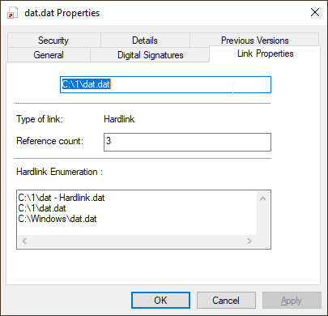
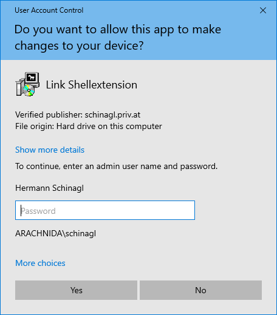
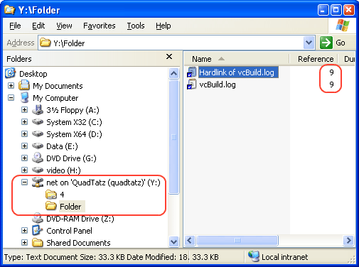
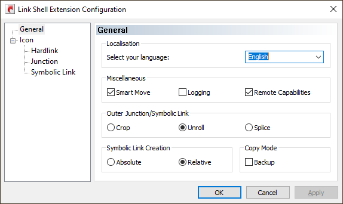

# Link Shell Extension (LSE)

 

<table data-cellspacing="10" data-cellpadding="0" data-border="0">
<colgroup>
<col style="width: 50%" />
<col style="width: 50%" />
</colgroup>
<tbody>
<tr>
<td colspan="2">Link Shell Extension</td>
</tr>
<tr>
<td colspan="2" height="22">

<em>Last Updated January 16 2021, Version 3.9.3.5</em>

</td>
</tr>
<tr>
<td class="hanger"><strong>Privacy
Statement</strong></td>
<td class="bodytext">The privacy statement can be found <a
href="https://schinagl.priv.at/about/dsgvo.html">here</a></td>
</tr>
<tr>
<td class="hanger"><strong>Quick
Start</strong></td>
<td class="bodytext"><a href="#contact">Download</a> 
<a href="#introduction">Documentation</a> 
<a href="#faq">Frequently asked questions (FAQ)</a> 
<a href="https://schinagl.priv.at/nt/ln/blog/blog.html">Blog</a> 
<a href="#history">History</a> 
<a href="#contact">Donations</a> 
 
<a
href="https://schinagl.priv.at/nt/hardlinkshellext/linkshellextension_fr.html">French</a> 
 
<a
href="https://schinagl.priv.at/nt/hardlinkshellext/linkshellextension_de.html">German</a> 
 
</td>
</tr>
<tr>
<td class="hanger"><strong>Introduction</strong></td>
<td class="bodytext">The NTFS file system supports a facility known as
<strong>hard links</strong> (referred to herein as
<strong>Hardlinks</strong>). Hardlinks provide the ability to keep a
single copy of a file yet have it appear in multiple folders
(directories).  They can be created with the POSIX command
<strong><em>ln</em></strong> included <em>in</em> the Windows Resource
Kit, the <em>fsutil</em> command utility included in Windows or my
command line <a href="https://schinagl.priv.at/nt/ln/ln.html">ln.exe</a>
utility  Thus, using standard Windows facilities Hardlinks can only be
created at the command prompt, which can be tedious, especially when
Hardlinks to multiple files are required or when one only makes
occasional use of Hardlinks.  Support for Junctions in standard
Microsoft software offerings is even more limited than that offered for
hardlinks.

Link Shell Extension (LSE) provides for the creation of <a
href="#hardlinks">Hardlinks</a>, <a href="#junctions">Junctions</a>, <a
href="#volumemountpoint">Volume Mountpoints</a>, and <a
href="#symboliclinks">Symbolic Links</a>, (herein referred to
collectively as Links) a folder <a href="#hardlinkclones">cloning
process</a> that utilises Hardlinks or Symbolic Links and a copy process
taking care of Junctions, Symbolic Links, and Hardlinks. LSE, as its
name implies is implemented as a Shell extension and is accessed from
Windows Explorer, or similar file/folder managers. 
The extension allows the user to select one or many files or folders,
then using the mouse, complete the creation of the required Links -
Hardlinks, Junctions or Symbolic Links or in the case of folders to
create Clones consisting of Hard or Symbolic Links. LSE is supported on
all Windows versions that support NTFS, Windows7/8/10. Hardlinks,
Junctions and Symbolic Links are NOT supported on FAT file systems, and
nor is the Cloning and Smart Copy process supported on FAT file
systems.

Within this document the terms <strong><em>action button</em></strong>
and <strong><em>action (pop up) menu</em></strong> are used to refer
what are often referred to as the right mouse button and the pop up menu
that is displayed when that mouse button is pressed (often referred to
as the context menu). Recognising that people swap the usage of their
mouse buttons, Microsoft refer to the <em>primary</em> and
<em>secondary</em> mouse buttons. We prefer to refer the mouse buttons
as the <strong>Select</strong> button and the <strong>Action</strong>
button; and rather than terms such as Context Menu, Shell Menu, Right
Mouse Menu we use the term <strong>Action</strong> menu.</td>
</tr>
<tr>
<td colspan="2"> 
</td>
</tr>
<tr>
<td class="hanger"><strong>Installation</strong></td>
<td class="bodytext">The current user must have administrator privileges
in order to install the software.

LSE is installed by executing the install program <a
href="#download">(HardLinkShellExt_$(platform).exe)</a>. Follow the
instructions issued by the program, there are no mandatory inputs
required during installation. It is possible to change the location into
which LSE is installed, the default is 
 
C:\Program Files\LinkShellExtension 

<strong>Smartscreen
pop-up</strong> 
With Windows 10 the SmartScreen facility of Windows Defender might pop
up and warns you: <em> 
 
Windows protected your PC 
Windows Defender SmartScreen prevented an unrecognized app from
starting. Running this app might put your PC at risk. 
 
</em> Please choose 'Install Anyway'. LSE is signed with a Standard Code
Signing Certificate, but not with an <a
href="https://blogs.msdn.microsoft.com/ie/2012/08/14/microsoft-smartscreen-extended-validation-ev-code-signing-certificates/">EV
Code Signing certificate</a>, which would prevent Smartscreen from
interferring. 
 
<strong>Explorer Restart</strong> 
During installation Explorer.exe has to be restarted to make Link Shell
Extension active. This means that all pending operations with
explorer.exe are interrupted but with the interactive install you can
decide to postpone the explorer.exe restart. A dialog box will give you
the choices during installation.

 
</td>
</tr>
<tr>
<td class="hanger"><strong>Installation
Arguments</strong></td>
<td class="bodytext">Some command line switches can be passed during
install, so that a silent install via .bat file can be acchieved. 
 
<strong>Silent install</strong> 
/S pops up no prompts during install. If the /S switch is used,
explorer.exe will be restarted after installation, to make Link Shell
Extension active immediately. 
 
<strong>Specify Language</strong> 
/LANGUAGE passes the language in which LSE shows up. e.g. 
 
 <strong>HardLinkShellExt_$(platform).exe /S
/Language=English</strong>  Currently <em>English, Chinese,
Czech, French, German, Greek, Italian, Japanese, Korean, Polish,
Portuguese, Russian, Slovak, Spanish, Swedish, Turkish and
Ukrainian</em> are available as valid parameters for the /Language
switch. 
 
<strong>Specify Directory</strong> 
When using the silent install a directory can also be specified with the
/D switch e.g. 
 
 <strong>HardLinkShellExt_$(platform).exe /S
/Language=English /D=C:\Program Files\LSE</strong>  
 
<strong>Uninstall</strong> 
Link Shell Extension can also be uninstalled silently by issuing 
 

<strong>$LSEInstallDir/uninst-HardLinkShellExt_$(platform).exe
/S</strong>  
 
If the /S switch is used during uninstall, explorer.exe will be
restarted after uninstallation, to make Link Shell Extension inactive
immediately. 
 
<strong>No Check for VcRedist</strong> 
 On some Windows10 machines, there is no need to install the
vcredist, or worse: VcRedist can not be installed, but is somehow
already on the system. To overcome this the /noredist switch can be
passed via command line. e.g.: 
 
 <strong>HardLinkShellExt_$(platform).exe
/noredist</strong> </td>
</tr>
<tr>
<td colspan="2"> 
</td>
</tr>
<tr>
<td class="hanger"><strong>Chocolatey 
Installation</strong></td>
<td class="bodytext">Link ShellExtension can also be installed via <a
href="https://chocolatey.org">chocolatey</a> by issuing 
 
 choco install linkshellextension  
 
from a command prompt. Make sure you have <a
href="https://chocolatey.org/install">chocolatey installed</a>. The
current user must have administrator privileges in order to install the
software via choco 
 
</td>
</tr>
<tr>
<td colspan="2"> 
</td>
</tr>
<tr>
<td class="hanger"><strong>Winget 
Installation</strong></td>
<td class="bodytext">LSE can also be installed via <a
href="https://winget.run/">winget</a> by issuing 
 
 winget install HermannSchinagl.LinkShellExtension
 
 
from a command prompt. Make sure you have <a
href="https://winget.run/">winget installed</a>. 
 
 
 
</td>
</tr>
<tr>
<td colspan="2"> 
</td>
</tr>
<tr>
<td class="hanger"><strong>Using Link
Shell Extension</strong></td>
<td class="bodytext"><strong>Pick Link Source</strong> causes the
selected files to be "stored" as the source for the Hardlinks that you
want to create. 
 
Pick Link Source 
 
To create the Hardlinks a destination folder must be chosen, by clicking
the mouse action button on the destination folder a menu will pop up,
which will include the entry - <strong>Drop HardLink</strong> 
 
Drop Hardlink 
 
Choosing <strong>Drop HardLink</strong> will create the hardlinks in the
selected destination folder. 
 
<strong>Overlay Icons for Hardlinks</strong> 
To help distinguish hardlinks folders from normal files, an
<strong>overlay icon</strong> is implemented on hardlinks that shows a
red arrow icon under the folder. 
 
Overlay Icon for Symbolic
Links 
 
Overlay icons for Hardlinks can also be <a
href="#customoverlayicons">customized.</a> 
 
</td>
</tr>
<tr>
<td class="hanger"><strong>Cancel current Pick Link
operation</strong></td>
<td class="bodytext">When doing an Action button click in the
destination folder background, in addition to the Drop HardLink option
there is the possibility to <strong>Cancel Link Creation</strong>
entry. 
 
Cancel the current pick
operation 
 
</td>
</tr>
<tr>
<td class="hanger"><strong>Popup
Submenu</strong></td>
<td class="bodytext">Since LSE supports <a
href="#junctions">Junction</a>, <a href="#hardlinkclones">Clones</a> and
<a href="#symboliclinks">Symbolic Links</a>, when one or more folders
are selected as the Source, they can be dropped in several ways. 
 
To avoid crowding the popup menu, a submenu is provided that contains
the different types of Links applicable to folders. 
 
Popup Submenu</td>
</tr>
<tr>
<td colspan="2"> 
</td>
</tr>
<tr>
<td class="hanger"><strong>Drag and Drop
Support</strong></td>
<td class="bodytext">Creating Hardlinks via drag and drop is supported,
after selecting one or more files you can drag them to the destination
folder with the Action button held down; when it is released choose
<strong>HardLink Here</strong> from the action menu to create the
Hardlinks of the selected files in the destination folder. 
 
Drag Hardlinks 
 
</td>
</tr>
<tr>
<td colspan="2"> 
</td>
</tr>
<tr>
<td class="hanger"><strong>Auto
Rename</strong></td>
<td class="bodytext">Files can be hard linked to the same folder as the
source folder. Because two directory entries cannot have the same name,
LSE uses '$filename - Hardlink.$ext' as the name of the the new
link. 
 
Automatic rename 
 
LSE uses the same hydraulics as explorer when it comes to multiple
'$filename - Hardlink': It uses numbers to enumerate the multiple
hardlinks of one file in the same directory, e.g. <em>$filename -
Hardlink (2).$ext.</em> 
 
The Auto Rename mechanism is also used when Junctions, Hardlink Clones,
Symbolic Links, Symbolic Link Clones, Mountpoints or Smart Copies are
created in the same directory. 
 
 
autorenamemultpiple.png 
 
</td>
</tr>
<tr>
<td class="hanger"><strong>Junction
Support</strong></td>
<td class="bodytext"><a
href="https://technet.microsoft.com/en-us/sysinternals/bb896768">Junctions</a>
provide for the creation of linkages among directories. 
 
Pick a directory as source for
Junction 
 
Junctions are created in the same way as Hardlinks, except that the
Source Link is a folder rather than a file. Select a folder, click the
right mouse button, choose <strong>Pick Link Source</strong> from the
action menu, navigate to the destination folder, click the action
button, open the submenu <strong>Drop As ...</strong> and select
<strong>Junction</strong>: 
 
Drop as Junction 
 
Junctions are marked with a small piece of chain below the folder
icon. 
 
Drop as Junction 
 
Junctions can also be created via Drag and Drop when the selected
folders are dragged with the action button pressed to a destination
folder; when the right mouse button is released, select the <strong>Drop
Here ...</strong> submenu and then <strong>Junction.</strong> 
 
Create a junction by dragging 
 
<strong>Overlay Icons for Junctions</strong> 
To help distinguish junction folders from normal folders, an
<strong>overlay icon</strong> is implemented on junctions that shows a
small three link chain icon under the folder. 
 
Overlay Icon for Junctions 
 
Overlay icons for junctions can also be <a
href="#customoverlayicons">customized.</a> 
 
Junctions can <strong>span network drives</strong> as long as the target
is a mapped network drive. Unfortunately Junctions, which have a UNC
Path as target, can be created with LSE, but even Windows7/8/10 seems to
contain a bug, which prevents it from dereferencing a UNC Path in a
junction, even if LSE correctly sets up the reparse info for UNC
junctions. When a UNC target junction is double clicked in explorer the
error ERROR_INVALID_REPARSE_DATA(4392), will show up and tell you that
the info in the reparse point is illegal, even if it is not. 
 
Elevation is needed in e.g. c:\Program Files for junctions beeing
created in. This is why the <a href="#VistaAndUAC">famous UAC</a> dialog
must be acknowledged. 
To be exact: Only the creation of directories needs elevation in such
situations, but creating an empty directory is a vital part of creating
a junction. The DeviceIoControl(), which does the real work in creating
junctions would work without elevation. 
 
</td>
</tr>
<tr>
<td class="hanger"><strong>Replacement
Junction 
Symbolic Link 
Mountpoint</strong></td>
<td class="bodytext">Link Shell Extension can change the target of an
existing Junction, Symbolic Link or MountPoint either via Pick/Drop or
Drag and Drop. 
 
To use this feature simply select an existing directory as Link Source
and drop it over an already existing Junction/Symbolic Link/Mountpoint.
By selecting the 'Drop as ... Replacement Junction/Symbolic
Link/MountPoint' from the action menu, the target of an already existing
Junction/Symbolic Link/MountPoint is replaced by the newly picked
target. 
 
Drop a junction for
replacement 
 
The same can be achieved via Drag an Drop for Symbolic Link Directories,
Junctions and Mount Points, but not for Symbolic Link Files. Symbolic
Link Files have to be repaired by the 'Pick Link Source', 'Drop as ...
Replacement Symbolic Link' repair alternative. 
 
When the <a href="#backupmode">backup mode</a> is selected the ACLs of
the Junction/Symbolic Link/MountPoint are preserved. 
 
</td>
</tr>
<tr>
<td class="hanger"><strong>Copy Junction 
Symbolic Link 
Mountpoint</strong></td>
<td class="bodytext">
Link Shell Extension can copy an existing
Junction, Symbolic Link or MountPoint either via Pick/Drop or Drag and
Drop.

copy a reparse point 
 
&#10;
To use this feature simply select an existing Junction, Symbolic Link
or MountPoint as Link Source and drop it over an already existing
directory. By selecting the 'Drop as ... Junction/Symbolic
Link/MountPoint Copy' from the action menu, the Junction/Symbolic
Link/MountPoint is copied to the target and the relation is adjusted

Drop a junction for
replacement 
 
&#10;
The same can be achieved via Drag an Drop for Symbolic Link
Directories, Junctions and Mount Points.

When the <a href="#backupmode">backup mode</a> is selected the ACLs
of the Junction/Symbolic Link/MountPoint are preserved.
</td>
</tr>
<tr>
<td class="hanger"><strong>Smart
Copy</strong></td>
<td class="bodytext">Smart Copy creates a copy of the directory
structure from the source location to the destination, but it preserves
the inner hardlink structure and inner junction/symbolic link relations
of the source, and recreates this inner hardlink structure and inner
junction/symbolic link relation at the destination location: 
 
&#10;
With hardlinks it behaves as follows:

Smart Copy How To 
 
&#10;
By closely looking at the above
picture one can find three different types of files:

<table class="bodytext" data-cellspacing="0" data-cellpadding="0"
data-border="0">
<colgroup>
<col style="width: 50%" />
<col style="width: 50%" />
</colgroup>
<tbody>
<tr>
<td class="hanger2"><strong>Normal Files</strong></td>
<td>The file B is a normal file. It gets copied as any other copy tool
would do. 
 
</td>
</tr>
<tr>
<td class="hanger2"><strong>Saturated Hardlinks</strong></td>
<td>The files E and F are hardlinked together. In LSE terms they are
called <em>Saturated Hardlinks</em>, because the reference count, which
is here 2, matches the number of occurrences below 'Folder 1', which is
here 2. 
 
&#10;
In General: A hardlink is called <em>Saturated</em> with respect to a
folder <em>F</em>, if the number of occurrences below the folder
<em>F</em> matches the reference count.

Saturated Hardlinks can be copied completely via Smart Copy.

 
</td>
</tr>
<tr>
<td class="hanger2"><strong>Unsaturated Hardlinks</strong></td>
<td>The File A, C, D are hardlinked together. In LSE terms they are
called <em>Unsaturated Hardlinks</em>, because the reference count,
which is here 3, does not match the number of occurrences below 'Folder
1', which is here 2. Only C and D are below Folder 1. 
 
&#10;
In General: A hardlink is called <em>Unsaturated</em> with respect to
a folder <em>F</em>, if the number of occurrences below the folder
<em>F</em> is smaller than the reference count.

Unsaturated Hardlinks can only be partially copied by Smart Copy. In
the above example C and D are hardlinked together in the destination
location, but the hardlink to A is broken. This means that the reference
count of C and D is 2 with the destination location.
</td>
</tr>
</tbody>
</table>
 
 
With junctions or symbolic link
directories <a href="#outerjunctionhandling">the default behaviour</a>
during smartcopy is as follows: 
 
Behaviour for inner junctions 
 
&#10;
By closely looking at the above picture one can find three different
types of folders/junctions:

<table class="bodytext" data-cellspacing="0" data-cellpadding="0"
data-border="0">
<colgroup>
<col style="width: 50%" />
<col style="width: 50%" />
</colgroup>
<tbody>
<tr>
<td class="hanger2"><strong>Normal Folders</strong></td>
<td>The folder 'Folder 3' is a normal folder. It gets copied with its
content as any other copy tool would do. 
 
 
</td>
</tr>
<tr>
<td class="hanger2"><strong>Inner Junctions 
Symlinks</strong></td>
<td>The folder 'Inner Junction/Symlink' is targeted at 'Inner
Junction/Symlink Target'. In LSE terms this kind of folder is called
<em>Inner Junction/Symlink</em>, because its target points to a folder,
which is below the common anchor 'Folder 1'. 
 
&#10;
<em>Inner Junctions/Symlink</em> are restored properly via Smart Copy
in the destination location.

 
</td>
</tr>
<tr>
<td class="hanger2"><strong>Outer Junctions 
Symlinks</strong></td>
<td>The folder 'Outer Junction/Symlink' is targeted at the folder 'Outer
Junction/Symlink Target'. In LSE terms this kind of folder is called
<em>Outer Junction/Symlink</em>, because its target points to a folder,
which is in parallel and thus outside the anchor 'Folder 1'. 
 
&#10;
<em>Outer Junctions/Symlink</em> can be handled in three different
ways. Please see the section on <a href="#outerjunctionhandling">Outer
Junction/Symlink Handling.</a>
</td>
</tr>
</tbody>
</table>
 
 
Windows7/8/10 support Symbolic Links, which behave as follows during
Smart Copy: 
 
Behaviour for inner symbolic
links 
 
By closely looking at the above picture one can find three different
types of files/symbolic links: 
 
&#10;<table class="bodytext" data-cellspacing="0" data-cellpadding="0"
data-border="0">
<colgroup>
<col style="width: 50%" />
<col style="width: 50%" />
</colgroup>
<tbody>
<tr>
<td class="hanger2"><strong>Normal Files</strong></td>
<td>The file A is a normal file. It gets copied as any other copy tool
would do. 
 
</td>
</tr>
<tr>
<td class="hanger2"><strong>Inner Symbolic 
Links</strong></td>
<td>The symbolic link 'Inner Symlink' is targeted at 'Inner Symlink
Target'. In LSE terms this kind of symbolic link is called <em>Inner
Symlink</em>, because its target points to a file, which is below the
common anchor 'Folder 1'. <em>Inner Symlink</em> are restored properly
via Smart Copy at the destination location. 
 
 
 
</td>
</tr>
<tr>
<td class="hanger2"><strong>Outer Symbolic 
Links</strong></td>
<td>The symlink 'Outer Symlink' is targeted at the folder 'Outer Symlink
Target'. In LSE terms this kind of symbolic link is called <em>Outer
Symlink</em>, because its target points to a file, which is in parallel
and thus outside the anchor 'Folder 1'. 
 
&#10;
<em>Outer Symlink</em> are handled by Smart Copy depending on the <a
href="#outerjunctionhandling">Outer Junction/Symbolic Link</a>
handling.
</td>
</tr>
</tbody>
</table>

Smart Copies are created in the same way as Junctions, select a
folder, click the Action button, choose <strong>Pick Link
Source</strong> from the action menu...

Pick Source for Smart Copy 
 
&#10;
...navigate to the destination folder, press the action button, open
the <strong>Drop As ...</strong> submenu and select <strong>Smart
Copy</strong>:

Drop Smart Copy 
 
&#10;
Smart Copy is a must if e.g.. the whole content of a hard disk, which
has lots of hardlinks/junctions/symbolic links, should be copied to
another hard disk. During the Smart Copy operation empty folders get
copied too and the date/time stamps of folders/junctions/symbolic links
are also restored at the corresponding destination locations.

Because Smart Copy creates inner hardlinks/junctions/symbolic links,
this feature is only available on NTFS volumes.

If Smart Copy takes longer than 250msec a progressbar shows the
status of the smart copy operation.

Smart Copy also processes all available alternative NTFS streams of a
file.

If items are already available in the destination, Smart Copy only
copies when the Files/Symbolic/Junctions/MountPoints are newer than the
already existing items.

When restoring Symbolic links LSE forks its helper LSEUacHelper.exe
to forwards this operation to it, because the creation of symbolic links
needs elevation, and thus brings up the <a href="#VistaAndUAC">famous
UAC</a> dialog.

LSE <strong>only</strong> issues its helper LSEUacHelper.exe if a
symlink is among/below the selected folders, so it saves you from one
UAC prompt if you don't have symlinks among your selection.

Smart Copy by default creates <a
href="#relativevsabsolutesymboliclinks">relative</a> symbolic links
during the Smart Copy operation.

<strong>Command Line 
 
</strong>The Smart Copy functionality is also available via command line
from <a href="https://schinagl.priv.at/nt/ln/ln.html">n.exe</a> via the
--copy command line switch.

 
 
</td>
</tr>
<tr>
<td class="hanger"><strong>Crop/Unroll/Splice 
Outer Junctions/ 
Symbolic Links</strong></td>
<td>During <a href="#smartcopy">SmartCopy</a>, <a
href="#smartmirror">Smart Mirror</a>, <a href="#deloreancopy">Delorean
Copy</a> and <a href="#hardlinkclones">Clone</a> so called <a
href="#innerjunction">Outer Junctions/Symlink directories</a> may need
processing. There are 3 different ways to deal with those Outer
Junctions/Symlink directories: 
 
&#10;<table class="bodytext" data-cellspacing="0" data-cellpadding="0"
data-border="0">
<colgroup>
<col style="width: 50%" />
<col style="width: 50%" />
</colgroup>
<tbody>
<tr>
<td class="hanger2"><strong>Crop</strong></td>
<td><em>Crop</em> breaks links to Outer Junctions/Symlink directories in
the destination. 
 
<em>Crop</em> also applies to Outer Symlink Files. 
 
Cropping outer Junctions 
 
&#10;
In the above example <em>Folder1</em> is copied to
<em>Destination/Folder1</em>, but<em>Outer Junction/Symlink</em> is not
available in the destination, because <em>Folder1/Outer
Junction/Symlink</em> pointed to <em>Folder0/Outer Junction/Symlink
Target</em>, which is not below <em>Folder1</em>.

The objective behind cropping Outer Junctions/Symlink Directories is
to get a pure copy during Smart Copy, Smart Mirror, Delorean Copy and
Clone without connections to the source.

<strong>Enabling Crop for Outer Junction/Symbolic
Links</strong> 
<em>Crop</em> can be selected via the <a
href="#configuration">configuration tool.</a>

 
 
</td>
</tr>
<tr>
<td class="hanger2"><strong>Unroll</strong></td>
<td><em>Unroll</em> follows Outer Junctions/Symlink Directories and
rebuilds the content of Outer Junctions/Symlink Directories inside the
hierarchy at the destination location. 
 
&#10;
<em>Unroll</em> also applies to Outer Symlink Files, which means,
that unroll causes the target of Outer Symlink Files to be copied to the
destination location.

Unroll Outer Junctions 
 
&#10;
In the above example <em>Folder1</em> is copied to
<em>Destination/Folder1</em>, and<em>Outer Junction/Symlink</em> and all
the files/directories below <em>Outer Junction/Symlink Target</em> are
copied to the folder <em>Outer Junction/Symlink</em> in the
destination.

The objective behind unrolling Outer Junctions/Symlink Directories is
to get everything with which the source is connected and rebuild it as
seperate copy in the destination. It resembles the 'hair of the
elephant' pattern: Pull on a hair of an elephant, and get the whole
elephant.

<em>Unroll</em> is the default behaviour for Smart Copy, Smart
Mirror, Delorean Copy and Clone.

<strong>Advanced thoughts on Unrolling</strong>

The picture above was just the simplest case, because <em>Unroll</em>
does much more when it encounters complex situations. Think of an outer
junctions/symbolic links, which itself contains junctions/symbolic
links, which are inner with respect to the first outer junction symbolic
link:

Unroll Inner Outer Junctions 
 
&#10;
In the above example <em>Folder1</em> is copied to
<em>Destination/Folder1</em>, and <em>Outer Junction/Symlink</em> and is
unrolled as expected, but since <em>Junction/Symlink</em> is an inner
junction with respect to <em>Outer Junction/Symlink Target</em>, the
junction/symlink relation is restored in the destination.

This kind of <strong>nesting</strong> can be much more complex:

Unroll Inner Outer Junctions 
 
&#10;
In the above example <em>Folder1</em> is copied to
<em>Destination/Folder1</em>, and <em>Outer Junction/Symlink</em> and is
unrolled as expected, but then it starts to get fascinating, because we
have two levels of outer junctions/symlinks which all have respective
inner junctions/symlinks, and which are restored properly. Once you
digged yourself through the above picture, you got it. It is not simple
I know, but it is necessary to properly unroll.

And complexity increases if <strong>symbolic link files</strong> are
within unrolled outer junctions/symbolic links:

Unroll Inner Outer Junctions 
 
&#10;
In the above example <em>Folder1</em> is copied to
<em>Destination/Folder1</em>, and <em>Outer Junction/Symlink</em> and is
unrolled as expected, but it contains <em>Inner Outer Symlink</em> which
points to <em>Inner Outer Symlink Target</em> and this is an inner
junction/symbolic link with respect to <em>Outer Junction/Symlink
Target</em>

But worth mentioning is the Symbolic Link <em>Outer Symlink</em>,
which would be a definitive outer symbolic link, but since its targets
parent-directory <em>Outer Junction/Symlink Target</em> is unrolled,
<em>Outer Symlink</em> becomes an inner symbolic link with respect to
<em>Folder1</em>.

<em>File1 Symlink</em> is also an outer symbolic link, but its target
parent-directory <em>Folder2</em> is not that lucky to get unrolled, so
in the destination <em>File1 Symlink</em> is not a symbolic link any
more, but a copy of the symbolic links' target.

 
 
&#10;
<strong>Nested Reparse Points</strong> are also an interesting use
case, which the algorithm has to tackle with:

Nested Reparse Points 
 
&#10;
In the above example <em>Folder1</em> is copied to
<em>Destination</em>, and <em>Junction/Symlink F0</em> and is unrolled
as expected, but it contains inner nested reparse points.
<em>Nested</em> means Reparse Points pointing to Reparse Points

The Unroll functionality also opens up the possibility to have
<strong>circular</strong> Junction/Symbolic Link relations among a set
of copied items:

Unroll Junctions Circularities 
 
&#10;
In the above example <em>Folder1</em> is copied via the --unroll
option to <em>Destination/Folder1</em>. Smart Copy/Smart Mirror and
Delorean Copy operations can deal with the above shown circularities and
break circularities by not following the affected Junction/Symbolic
Link.

Junctions/Symbolic Links can also point to FAT drives or other NTFS
drives requiring as a prerequisite unique Disk-IDs on all disks, which
are chained together via Junctions/Symbolic links: 
 
Unroll Junctions Unique DiskID 
 
&#10;
Hardlink siblings are found by matching the per NTFS volume uniqe
file-id, but if more volumes are chained together it might happen that
the same file-ids can be found on two different NTFS volumes. To address
this all operations use the disk-id and the file-id to match hardlink
siblings.

Furthermore it is not allowed to have the disk-id 0xffff-ffff,
because the algorithms use this as internal indicator of a FAT
drive.

The Unroll option also allows to point multpile junctions to the same
target location, which causes the algorithms to traverse the same items
many times:

Unroll Junctions Unique DiskID 
 
&#10;
At the first glance multiple traversation of items looks simple, but
for files this means that multiple traversed files are the same in the
destination and are hardlinked together. So don't be confused when you
see hardlinks, which have never ever been there before.

 Copying Junction/Symbolic Links
from mapped network drives also needs extra care, because junctions on
the remote machine relate with path references only valid on the remote
machine to each other:

Mapped Network Drive Reparsepoint
Resolution 
 
The example in the above picture shows such a situation
<ul>
<li>X:\Src\Foo\Junction/Symlink is a junction on a Remote Machine, which
points to X:\Src\Foo\Folder. It is a valid Junction.</li>
<li>X:\Src\Foo is sharded via \\RemoteMachine\MyShare, which still is no
problem.</li>
<li>\\RemoteMachine\MyShare mapped to T:\ on a local machine is fine,
but the Junction T:\Junction/Symlink, if asked for its target, will
still return X:\Src\Foo\Folder even on the Local Machine. One could
expect that the target is T:\Folder, but it is not for Junctions.</li>
<li>When SmartCopy/Mirror/Delorean comes across such a situation, it
translates the Junction correctly when it is copied onto the Local
Machines drive Y:\, so that the final Junction target points correctly
to Y:\Dest\Bar\Folder</li>
</ul>
 
</td>
</tr>
<tr>
<td class="hanger2"><strong>Splice</strong></td>
<td><em>Splice</em> reconnects Outer Junctions/Symlink directories in
the destination to their original targets. 
 
Splice outer Junctions 
 
&#10;
In the above example <em>Folder1</em> is copied to
<em>Destination/Folder1</em>, and <em>Outer Junction/Symlink</em> is
available in the destination as junction, which points to the original
location <em>Outer Junction/Symlink Target</em>.

The objective behind splicing Outer Junctions/Symlink Directories to
its original location is to get a copy during smartcopy, but to reuse
Outer Junctions/Symlink Directories source locations.

 The <em>Splice</em> functionality
is also useful, when mountpoints should be copied. Mountpoints are very
similar to Junctions, but point to a path always starting with
\\?\VolumeGuid{}.

Copy Mountpoint with Splice  
 
<strong>Enabling Splice for Outer Junction/Symbolic Links</strong>

<em>Splice</em> can be selected via the <a
href="#configuration">configuration tool.</a>

 
 
</td>
</tr>
</tbody>
</table></td>
</tr>
<tr>
<td class="hanger"><strong>Multiple
Source</strong></td>
<td>Multpiple Source Locations can be specified for SmartCopy, Clone,
and Delorean Copy. If there are junctions/symlinks between these source
locations, they are handled as inner junctions/symbolic links, because
all source locations are dealt like a common root. 
 
Multiple Sources

In the above example <em>Location1</em> and <em>Location2</em> are
copied to <em>Destination</em>. <em>Location2/Junction20</em> is treated
as inner junctions to <em>Location1/Folder10</em> in the source, and
that's why <em>Destination/Junction20</em> points to
<em>Destination/Folder10</em> in the Destination.

The objective behind this is to treat all junctions/symlinks as inner
junctions/symlins as long as they are in the set of source folders.

With LinkShell Extension this works as follows:

Multiple source are selected

In the above example all content from <em>Location 1</em> and
<em>Location 2</em> and pskill.exe are selected. Possible
junctions/symbolic links in <em>Location 1</em> pointing to <em>Location
2</em> or vice versa are treated as inner junctions/symbolic links,
because all selection is treated as a common root.

 
 
</td>
</tr>
<tr>
<td colspan="2"> 
</td>
</tr>
<tr>
<td class="hanger"><strong>Smart
Move</strong></td>
<td class="bodytext">Smart Move enables folders with junctions and
symbolic links beneath to be renamed. The junctions and symbolic links'
targets are updated below that folder. Without Smart Move renaming of
such folders would end in dead junctions and symbolic links.

With junctions or symbolic link directories it behaves as
follows:

Smart Move behaviour for junctions and
symbolic links

By closely looking at the above picture one can find three different
types of folders/junctions:

<table class="bodytext" data-cellspacing="0" data-cellpadding="0"
data-border="0">
<colgroup>
<col style="width: 50%" />
<col style="width: 50%" />
</colgroup>
<tbody>
<tr>
<td class="hanger2"><strong>Normal Folders</strong> 
 
</td>
<td>The folder 'Folder 3' is a normal folder. It gets moved with its
content straight forward.

 
 

</td>
</tr>
<tr>
<td class="hanger2"><strong>Inner Junctions 
Symlinks</strong> 
 
</td>
<td>The folder 'Inner Junction/Symlink' is targeted at 'Inner
Junction/Symlink Target'. In LSE terms this kind of folder is called
<em>Inner Junction/Symlink</em>, because its target points to a folder,
which is below the common anchor 'Folder 1'.

<em>Inner Junctions/Symlink</em> are updated properly via Smart Move
in the destination location.

 
 

</td>
</tr>
<tr>
<td class="hanger2"><strong>Outer Junctions 
Symlinks</strong> 
 
</td>
<td>The folder 'Outer Junction/Symlink' is targeted at the folder 'Outer
Junction/Symlink Target'. In LSE terms this kind of folder is called
<em>Outer Junction/Symlink</em>, because its target points to a folder,
which is in parallel and thus outside the anchor 'Folder 1'.

<em>Outer Junctions/Symlinks</em> are not touched by Smart Move and
thus stay connected to their respective target. Please note that this is
different to Smart Copy, which has <a href="#outerjunctionhandling">3
different ways</a> to deal with Outer Junctions/Symbolic Links.

 
 
</td>
</tr>
</tbody>
</table>

The Smart Move functionality is integrated into Explorer seamlessly,
so that you don't have to do anything special. Simply drag a folder in
explorer to its destination location, or e.g. press F2 in Explorer to
rename a directory and LSE will intercept this operation under the hood,
takes care of junctions or symbolic links, and will update them.

Intercepting move and rename operation means, that LSE takes over
control before rename/move, and recursivley searches the selected folder
for junctions or symbolic links. But searching large amounts of files
and folders takes time, so LSE will show a progress bar when searching
takes longer than 250msec.

Progress bar during Smart Move

If symbolic links have to be updated LSE calls its <a
href="#VistaAndUAC">UAC</a> helper LSEUacHelper.exe. 
 
If backup mode is enabled the UAC helper LSEUacHelper.exe is called
anyway, because LSE needs to enumerate files in locations, where it
might have no permissions. 
 
&#10;
Smart Move creates <a
href="#relativevsabsolutesymboliclinks">relative</a> symbolic links
during the Smart Move operation.

If a LocalizedResourceName is given via desktop.ini and the very
folder is readonly, SmartMove will not work. This seems to be a bug in
Shell Explorer ever since. ICopyHook::CopyCallback() is not called at
all in this situation.

<strong>Enabling/Disabling Smart Move</strong> 
Smart Move can be switched on/off via the <a
href="#configuration">configuration tool</a>

<strong>Command Line 
</strong> The Smart Move functionality is also available via command
line from <a href="https://schinagl.priv.at/nt/ln/ln.html">ln.exe</a>
via the --move command line switch.

 
 
</td>
</tr>
<tr>
<td class="hanger"><strong>Clone</strong></td>
<td class="bodytext">Clones are copies of a folder tree from a source
location recreated at the destination location, however the files within
the new folder tree are Hardlinks or Symbolic Links to the respective
files in the source folder tree.

Hardlink Clones how to

 
 
A folder tree might also contain Junctions or Symbolic Links. The clone
process recreates <a href="#innerjunction">inner junction/symbolic</a>
links at the destination location very similar as Smart Copy does.

Hardlink Clones the smart way

 
 
Outer Junctions/Symbolic links are recreated with respect to the
specified <a href="#outerjunctionhandling">Outer Junction/Symbolic Link
handling</a>. e.g.

With Windows7/8/10 this cloning process is also available with
Symbolic Links instead of Hardlinks.

Symbolic Link Clones the smart
way

 
 
&#10;
Clones are created in the same way as e.g Junctions. Select a folder,
click the Action button, choose <strong>Pick Link Source</strong> from
the action menu...

Pick Source for Hardlink Clone

...navigate to the destination folder, press the action button, open
the <strong>Drop As ...</strong> submenu and select <strong>HardLink
Clone</strong>:

Drop a Hardlink Clone

... choose Symbolic Link Clone to create clones of existing tree
structures.

Drop a Symbolic Link Clone

HardLink and Symbolic Link Clones can also be created via Drag and
Drop. Select a folder and drag with the action button depressed to a
destination folder. When the action button is released open the
<strong>Drop Here...</strong> submenu and select <strong>HardLink
Clone</strong> or with Windows7/8/10 <strong>Symbolic Link
Clone</strong>:

Drop Hardlink Clone.png

 
 
&#10;
HardLink or Symbolic Link Clones are useful if you need to replicate
a folder tree at a different location. The disk space required is
minimal because the new structure consists entirely of NTFS directory
entries with no real amount of actual data storage.

If both files and folders are selected as Source Links and dropped as
a <strong>HardLink Clone</strong> then the selected files are dropped as
Hardlinks alongside the HardLink Clones.

Because Clones use Hardlinks or Symbolic Links, they are only
available within an NTFS volume. Hardlink Cloning can not replicate the
folder structure from one disk volume to a different volume, because
Hardlinks are limited to operation on a single volume. Symbolic Link
Clones can be used to create volume spanning Clones.

When creating Clones, LSE forks its helper LSEUacHelper.exe to
forwards this operation to it, if the folder tree contains <a
href="#innerjunction">symbolic links</a>, because the creation of
symbolic links needs elevation, and thus brings up the <a
href="#VistaAndUAC">famous UAC</a> dialog. 
LSE <strong>only</strong> issues its helper LSEUacHelper.exe if a
symlink is among/below the selected folders, so it saves you from one
UAC prompt if you don't have symlinks among your selection.

 
<strong>Limitations</strong> 
 Hardlink creation needs write access to the source hardlink
sibling. This means Hardlink Clone will fail, and just generates an
empty directory structure, if write access for the source files is not
available. This is caused in the way Windows implements hardlinks,
because the security information for a file and thus for all hardlink
siblings is shared among all hardlink siblings. 
 
Creating hardlink clones in such cases can be enabled, by granting write
access for the source files to the user who will create a hardlink
clone, or in a single user use-case to everyone. 
 

<strong>Command Line 
</strong> The Clone functionality via Hardlinks or Symbolic Links is
also available via command line from <a
href="https://schinagl.priv.at/nt/ln/ln.html">ln.exe</a> via the
--recursive command line switch.

 
</td>
</tr>
<tr>
<td class="hanger"><strong>Smart
Mirror</strong></td>
<td class="bodytext">Smart Mirror is very similar to <a
href="#smartcopy">Smart Copy</a> and not only copies but
<em>synchronises</em> the folder <em>Source</em> to
<em>Destination</em>:
<ul>
<li>Smart Mirror copies if the timestamp of items in the
<em>Destination</em> is different from the <em>Source</em>.</li>
<li>Delete files not anymore available in <em>Source</em> from
<em>Destination</em>.</li>
</ul>
Smart Mirror takes care of Hardlink Relations, Restores Inner Junctions
or Inner Symbolic links or when issued <a
href="#outerjunctionhandling">unrolls or splices</a> Outer Junctions or
Outer Symbolic Links.

Smart Mirror is created in the same way as e.g Junctions. Select a
folder, click the Action button, choose <strong>Pick Link
Source</strong> from the action menu...

Pick Source for Hardlink Clone

...navigate to the destination folder, press the action button, open
the <strong>Drop As ...</strong> submenu and select <strong>Smart
Mirror</strong>:

Drop a Smartmirror

 
&#10;
Smart Mirror is a little bit different with respect to <a
href="#autorename">Auto Rename</a>, because it expects a already
existing folder in the destination location, which has the same name as
the source folder, so that it can do the mirror.

 
&#10;
 

</td>
</tr>
<tr>
<td class="hanger"><strong>DeLorean
Copy</strong></td>
<td class="bodytext">DeLorean Copy is a way of creating incremental
backups by using a combination of hardlink clone and Smart Copy.

The following picture gives an overview what DeLorean Copy is
about

DeLorean Copy Behaviour

In general a DeLorean Copy has 3 principals: Source(t), InitialBackup
and Backup(n).

<table class="bodytext" data-cellspacing="0" data-cellpadding="0"
data-border="0">
<colgroup>
<col style="width: 50%" />
<col style="width: 50%" />
</colgroup>
<tbody>
<tr>
<td class="hanger2"><strong>Phase 1: Initial SmartCopy</strong> 
 
</td>
<td>The folder <em>Source(t)</em> is initially copied to
<em>InitialBackup</em>. This is shown by the blue arrow. 
 
</td>
</tr>
<tr>
<td class="hanger2"><strong>Changes 
happen</strong> 
 
</td>
<td>During this phase the files under source change, and
<em>Source(t)</em> becomes <em>Source(t+1).</em> 
 
</td>
</tr>
<tr>
<td class="hanger2"><strong>Phase 2: Hardlink Clone 
</strong> 
 
</td>
<td>The folder <em>InitialBackup</em> is Hardlink Cloned to
<em>Backup1,</em> which ties <em>InitialBackup</em> and
<em>Backup1</em>. This is shown by the red arrow. 
 
</td>
</tr>
<tr>
<td class="hanger2"><strong>Phase 3: Mirror 
</strong></td>
<td>Mirrors the folder <em>Source</em> to <em>Backup1</em>. This is
shown by the green arrow:
<ul>
<li>Keeps unchanged files as hardllinks to InitialBackup.</li>
<li>Deletes files not anymore in Source(t+1) from Backup1.</li>
<li>Copies different files from <em>Source(t+1)</em> to
<em>Backup1</em>.</li>
</ul></td>
</tr>
</tbody>
</table>
With completion of this first round <em>Backup1</em> contains the first
lean and mean copy of <em>Source</em> only consisting of either
hardlinks to <em>InitialBackup</em>, or of copied files if there was the
need to copy them over from <em>Source(t+1)</em> because they were newer
under <em>Source(t+1)</em>. 
The point is that all files in <em>Backup1</em> are transparently
accessible, but really little space is used, because not all files in
the <em>Source(t+1)</em> changed, so that there was only the need to
effectively copy over a few files from <em>Source(t+1)</em> to
<em>Backup1</em>. 
This can be repeated on and on. The second round would be using
<em>Source</em>, <em>Backup1</em> and <em>Backup2</em> for DeLorean
Copy: 
 
&#10;<table class="bodytext" data-cellspacing="0" data-cellpadding="0"
data-border="0">
<colgroup>
<col style="width: 50%" />
<col style="width: 50%" />
</colgroup>
<tbody>
<tr>
<td class="hanger2"><strong>Changes 
happen</strong> 
 
</td>
<td>During this phase the files under source change, and
<em>Source(t+1)</em> becomes <em>Source(t+2).</em> 
 
</td>
</tr>
<tr>
<td class="hanger2"><strong>Phase 2: Hardlink Clone 
</strong> 
</td>
<td>The folder <em>Backup1</em> is Hardlink Cloned to <em>Backup2</em>,
which ties <em>Backup1</em> and <em>Backup2</em>. This is shown by the
red arrow. 
 
</td>
</tr>
<tr>
<td class="hanger2"><strong>Phase 3: Mirror 
</strong> 
</td>
<td>Mirrors the folder <em>Source(t+2)</em> to <em>Backup2</em>. This is
shown by the green arrow:
<ul>
<li>Keeps unchanged files as hardllinks to Backup1.</li>
<li>Deletes files not anymore in Source(t+2) from Backup2.</li>
<li>Copie newer files from <em>Source(t+2)</em> to
<em>Backup2</em>.</li>
</ul></td>
</tr>
</tbody>
</table>
 
&#10;
DeLorean Copies are created in the same way as e.g Junctions. Select
a folder, click the Action button, choose <strong>Pick Link
Source</strong> from the action menu...

Pick a directory for DeLorean
Copy 
&#10;
...navigate to the destination folder, press the action button, open
the <strong>Drop As...</strong> submenu and select <strong>DeLorean
Copy</strong>:

Pick a directory for DeLorean
Copy 
&#10;
If a DeLorean Copy was dropped the first time onto a directory, the
operations, which are described under phase 1 in the above descriptions,
namely a Smart Copy, is performed. Link Shell Extension automatically
generated the folder name for the destination by appending a
timestamp. 

Any successive drop of a directory onto the a destination directory
initates Phase 2 and Phase 3 from the above description, namley it does
the Hardlink Clone from the former backup onto the current backup and
furthermore does mirror the source onto the current backup. 

A directory holding many copies may look like this. 

Directory with many DeLorean
Copies

 
<strong>Limitations</strong> 
It is little known, but NTFS has a limit to create a maximum of 1023
hardlinks to one file. For DeLorean Copy this means that it will display
an error message if this limit is exceeded, because exceeding this limit
means loss of data among the most recent backup sets: 
 
Delorean Exceed 1023 Hardlink
Limit

 
The reason for exceeding this limit could either be, that there have
been more than 1023 backup sets but no hardlinks within the
<em>Source</em>, or there are hardlinks within the <em>Source</em> and
less than 1023 backup sets.

 
The DeLorean Copy submenue will <strong>not</strong> appear if
<strong>more than one</strong> folders are selected as source.

 
DeLorean Copy is long path safe which means it can handle more than 256
characters in pathes. This is important, because placing a copy with
quite long path, but still below 256 characters path length, to
destination locations might result in combined path length greater than
256 character. In such a situation no data loss must happen, which
Delorean copy guaranties with beeing 'long path safe'. Please make sure
that Explorer can not show you the result of such a copy, but the files
are there. Alternative explorers like <a
href="https://www.speedproject.de/">SpeedCommander</a> can handle
this.

 

<strong>Command Line 
</strong> DeLorean Copy functionality is also available via <a
href="https://schinagl.priv.at/nt/ln/ln.html#deloreancopy#deloreancopy">ln.exe</a>

 
 
</td>
</tr>
<tr>
<td class="hanger"><strong>Backup
Mode</strong></td>
<td class="bodytext">
Backup mode enables LSE to also copy ACLs and
Encrypted Files from all directories, even the ones without access for
the current users.

<ul>
<li>LSE always forks its helper process LSEUacHelper.exe, and thus
raises the <a href="#VistaAndUAC">UAC prompt</a> for elevation and
password verification.</li>
</ul>
It applies to SmartCopy, SmartMirror, SmartClone, Delorean Copy,
SmartMove and Replacement Junction/Symbolic Link/Mountpoint.
LSE.exe thus copies
<ul>
<li>Alternative Streams on files and folders</li>
<li>EA Records on files and folders (rarely used)</li>
<li>Reparse Info</li>
<li>File Attributes</li>
<li>Timestamps: Creation Time, Last Access Time, Last Write Time</li>
<li>Sparse Files and Alternative Sparse Streams</li>
<li>Encrypted files</li>
<li>ACLs</li>
</ul>

Backup Mode is disabled by default, and can be turned on via the <a
href="#configuration">LSE configuration</a> tool.

 To perform backup operations a user
must hold the SE_BACKUP_NAME and SE_RESTORE_NAME privileges. An out of
the box Wndows configuration assigns the Backup-Operator and
Administrator group these privileges, but additionally the above
privileges can be assigned individually to certain users or
groups. 
 
Assigning privileges can be accomplished 
<strong>By gpedit.msc</strong>

Changing Privileges for Backup
operations

 
and navigating to 
"Computer Configuration" -&gt;"Windows settings" -&gt; "Security
Settings" -&gt; "Local Policies" -&gt; "User Rights Assignments" -&gt;
"Backup files and directories" 
"Computer Configuration" -&gt;"Windows settings" -&gt; "Security
Settings" -&gt; "Local Policies" -&gt; "User Rights Assignments" -&gt;
"Restore files and directories" 
 
&#10;
<strong>Without gpedit.msc</strong> 
Download <a
href="https://www.southsoftware.com/polsedit.zip">PolsEdit</a> and add
users or groups, who should be able to run backups, to the
SE_BACKUP_NAME and SE_RESTORE_NAME privileges.

 
 
</td>
</tr>
<tr>
<td class="hanger"><strong>Volume
Mount 
Point Support</strong></td>
<td class="bodytext">
Volume Mountpoints provides functionality to map
complete local volumes onto arbitrary disk locations.

Pick volume as source for a Volume
Mountpoint

 
&#10;
Volume Mountpoints are created in the same way as Hardlinks, except
that the Source Link is a volume rather than a file. Select a local
volume, click the right mouse button, choose <strong>Pick Link
Source</strong> from the action menu, navigate to the destination
folder, click the action button, open the submenu <strong>Drop As
...</strong> and select <strong>Volume Mountpoint</strong>:

Drop as Mount Point

 
&#10;
Volume Mountpoints can also be created via Drag and Drop when the
selected local volume is dragged with the action button pressed to a
destination folder; when the right mouse button is released, select the
<strong>Drop Here ...</strong> submenu and then <strong>Volume
Mountpoint.</strong>

Drag a Volume onto a Mount Point

 
&#10;
Mount Points can be deleted by using the Unmount Volume command from
Explorer as usual.

Delete a Volume Mountpoint

 
&#10;
To show the origin of a Volume Mountpoint, the <a
href="#referencecount">reference column</a> of a Volume MountPoint shows
the volume which is mounted onto the selected path.

Make sure that only local volumes can be mounted but not mapped
network drives.

The creation and deletion of Volume Mountpoints is bound to
successful elevation, which means that the <a href="#VistaAndUAC">famous
UAC</a> dialog must be acknowledged.

 
 
</td>
</tr>
<tr>
<td class="hanger"><strong>Reference
Count</strong></td>
<td class="bodytext">As described in the <a
href="#backgrounders">backgrounders section</a> NTFS maintains a
reference count for each data stream object how many NTFS directory
entries refer to that objects. 
 
&#10;
To show the reference counts, a column can be enabled in Explorers
right pane by action clicking the Titles row of the details view.

Select Columns

After enabling the reference column the reference count is shown for
each file.

Reference Count for Hardlinks

 
&#10;
<strong>Windows7/8/10:</strong> The column, which shows the reference
count and the origin of the junction is not available, because the way
Windows7/8/10 handles user defined columns has been completely revamped
by Microsoft and all applications working with so called ColumnHandlers
will not work.

 
</td>
</tr>
<tr>
<td class="hanger"><strong>Link
Properties</strong></td>
<td class="bodytext">
Link Shell Extension also supports so called
Explorer Property Sheets, which means that if a file or directory
property in explorer is opened, Link Shell Extension adds its own tab to
show the properties of a hardlink, junction, volume mountpoint or
symbolic link.

This additional tab only shows up in the file or directory properties,
if the file or directory is a hardlink, junction, volume mountpoint or
symbolic link, otherwise this tab is not available.

Property Sheet for Links

<strong>Explore</strong> 
For junctions, volume mountpoints or symbolic links this dialog also
shows a 'Explore Target' button, which opens an explorer in the
specified directory.

<strong>Edit</strong> 
For Junctions, Symbolic Links or Mountpoints the target field can be
edited, and after either pressing the Apply button or leaving the Link
Property dialog with ok, the changes are applied to the Junction,
Symbolic Link or Mountpoint.

If the <a href="#backupmode">Backup Mode</a> is enabled, the ACL of
the edited Junction, Symbolic Link or Mountpoint is preserved.

 
</td>
</tr>
<tr>
<td class="hanger"><strong>SymbolicLinks</strong></td>
<td class="bodytext">LSE supports the creation of symbolic links. 
 
&#10;
Creating a <strong>Symbolic Link</strong> is essentially the same as
the other Link creation processes. Action click on the selected file(s)
and select Pick Link Source(s) from the action menu.

Pick Link Source

 
&#10;
When the destination folder is action clicked the menu contains a
<strong>Drop As ...</strong> submenu, to create a Symbolic Link select
SymbolicLink from the submenu. Unlike Hardlinks Symbolic Links can span
storage volumes.

Drop a Symbolic Link Folder

 
&#10;
If both files and folders are selected as the Source Links and
dropped as a <strong>Symbolic Link Clone</strong> then the selected
files are dropped as Symbolic Links alongside newly created <em>Symbolic
Link Clone</em> folders.

Symbolic Links can also be created between directories.

 
&#10;
<strong>Relative versus
absolute symbolic link target pathnames</strong> 
 The target of a symbolic link can either be

<ul>
<li>a fully qualified path starting at the root of a drive, e.g
e:\data\cpp\myfile.txt</li>
<li>or can be be specified relativeley, e.g
..\..\data\cpp\myfile.txt</li>
</ul>
LSE by default tries to create <strong>relative</strong> target path
names for symbolic links as long as this is possible, e.g the file and
its target are on the same logical drive. Having relative symbolic link
targets is much smarter especially when the target of links is in the
same directory. If a symbolic link and its target are on different
drives, LSE uses absolute pathnames.

 
The <a href="#configuration">configuration</a> tool can switch Link
Shell Extension in either relative or absolute mode.

 
 
<strong>Overlay Icons for
Symbolic Links</strong> 
To help distinguish Symbolic Links from normal files/directories, an
<strong>overlay icon</strong> is implemented on symbolic links that
shows a light green arrow icon under the folder. 
 
 
 
Overlay icons for Symbolic Links can also be <a
href="#customoverlayicons">customized.</a>

 

</td>
</tr>
<tr>
<td class="hanger"><strong>Enumeration
of Hardlinks</strong></td>
<td class="bodytext">
Simply select a hardlinked file and select <a
href="#linkproperties">Properties</a> from the action menu:

 
&#10;
The Hardlink Enumeration functionality is also available via command
line from <a href="https://schinagl.priv.at/nt/ln/ln.html">ln.exe</a>
via the <a
href="https://schinagl.priv.at/nt/ln/ln.html#enumhardlinks#enumhardlinks">--enum</a>
or the <a
href="https://schinagl.priv.at/nt/ln/ln.html#listsiblings#listsiblings">--list</a>
command line switch.

 
 
</td>
</tr>
<tr>
<td class="hanger"><strong>UAC</strong></td>
<td class="bodytext">
Due to UAC some API calls need elevation to
administrative level, and this elevation must be acknowledged via the
below shown dialog box. So if you see the below box, and the program
asking for elevation is LSEUacHelper.exe, it is Link Shell Extensions
contribution to UAC and you must acknowledge it to get Symbolic Links
created.

 
 
</td>
</tr>
<tr>
<td class="hanger"><strong>Change
Symbolic Link Privilege</strong></td>
<td class="bodytext">
One way to come around the UAC prompt for the
creation of Symbolic Links is to globally allow users to create Symbolic
Links by changing the policy.

<strong>With gpedit.msc</strong> 
Start gpedit.msc from the command line and grant/revoke specific users
the permissions: Under "Computer Configuration" -&gt;"Windows settings"
-&gt; "Security Settings" -&gt; "Local Policies" -&gt; "User Rights
Assignments" -&gt; "Create Symbolic Links".

Changing Privileges for Symblic Link
Creation

<strong>Without gpedit.msc</strong> 
Download <a
href="https://www.southsoftware.com/polsedit.zip">PolsEdit</a> and add
users to SE_CREATE_SYMBOLIC_LINK_NAME. 
Please make sure you log off and log on after changing policies, so that
the changes become active.

Linkshell Extension can deal with the above granting of privileges,
and if the Symblic Link Privilege is available avoids the UAC
prompt.

 
&#10;
<strong>Developer mode in Windows10</strong> 
Another way to come around the UAC prompt would be to <a
href="https://www.howtogeek.com/292914/what-is-developer-mode-in-windows-10/">enable
the developer mode</a>, which is available since Windows10/14972.

 
</td>
</tr>
<tr>
<td class="hanger"><strong>Remote
Capabilities</strong></td>
<td class="bodytext">It is little known, but the SMB networking protocol
supports operations to create remote Hardlinks, Junctions and Symbolic
Links within SMB mapped network NTFS drives.

This feature is used by Link Shell Extension, to enable the creation
of so called Remote Hardlinks, Remote Junctions, or Remote Symbolic
Links. e.g. 
 

<ul>
<li>Map a network share</li>
<li>Pick a file from that share</li>
<li>Drop the file as Hardlink within the same share</li>
</ul>
 
A Hardlink has been created, which can be easily verified 
 

 
Furthermore SMB1.0 also reports the reference count for Hardlinks and
the junction origin for Junctions, which enables Link Shell Extension to
show the properties dialog for remote files. Currently the reference
count of a hardlink is reported via SMB1.0 in 90% correctly, so please
be aware of this restriction.

LSE supports both, mapped network drives and UNC paths.

Mapped but not available network drives can in general be the reason
for sloppy explorer startup performance. Delays of a few seconds can be
experienced if explorer has to check all drive mappings, especially the
ones which are not available. This gets worse, if LSE also checks the
status of all drives.

To workaround this caveat the Remote Capabilities of Link Shell
Extension can be switched on/off via the <a
href="#configuration">configuration</a> tool. 

<strong>Remote Hardlinks and the SMB version</strong> 
There are differnet SMB Version implemented in different Windows
versions which means different behaviour for hardlinks:

SMB1.0: Windows XP, Windows2000 ... 
SMB2.0: Windows Vista ... 
SMB2.1: Windows7/8, Windows Server 2008 R2 ... 

SMB3.0: Windows10, Windows Server 2012 R2 ... 

All of those version support the creation of hardlinks remotely, but
since SMB2.0 one can not find out if a file on a remote drive is a
hardlink or not.

This means, that e.g if you connect with your Windows XP machine to a
SMB2.1 drive, which is provided by a Windows7/8/10 machine, you will not
be able to see overlay icons for hardlinked files, but you will be able
to create them remotley. 

 
 

</td>
</tr>
<tr>
<td class="hanger"><strong>Removeable
Media</strong></td>
<td class="bodytext">LSE supports removable media, which have been
formatted with NTFS, to create all kind of features it does for fixed
drives too. The only limitation is that it intentionally won't work on
removable media if they are mounted to drive A: or B:. The reason is
that A: or B: are commonly used for floppy drives.

With removable media formatted to NTFS there is the slight chance
that LSE reports 'Access denied' problems, when creating hardlinks or
junctions. This is due to file object permissions on the removable NTFS
drive, which have been created with a different computer on that
removable media, thus causing this 'Access denied' messages. The
solution here is to change the permission on that removable media as
Administrator. 
 

</td>
</tr>
<tr>
<td class="hanger"><strong>Very long
Path</strong></td>
<td>Explorer supports pathnames up to 256 characters, thus limiting all
applications to that length for pathnames.

On the other hand NTFS supports pathnames with up to 32767
characters, so one might have already experienced pathnames, which are
longer than 256 characters. To deal with that, LSE can handle <em>Very
Long Path</em> up to 32767 characters with all operations.

 
</td>
</tr>
<tr>
<td class="hanger"><strong>Subst
Handling</strong></td>
<td class="bodytext">
With the subst.exe command one can create
driveletters, which point to a certain path on a NTFS volume. This means
that two different driveletters in the end might resolve to locations on
the same NTFS volume. 
Link Shell Extension checks these situations when it comes to allow the
creation of hardlinks, and as a consequence allows the creation of
hardlinks among different logical drives if they resolve to the same
NTFS volume.

 
</td>
</tr>
<tr>
<td class="hanger"><strong>ReFs
Support</strong></td>
<td class="bodytext">
With Windows Server 2012 Microsoft introduced
the <a
href="https://blogs.msdn.com/b/b8/archive/2012/01/16/building-the-next-generation-file-system-for-windows-refs.aspx">ReFS</a>
filesystem, which is the designated successor to NTFS. But the first
implementation of ReFS can do nice things, but lacks a few important
features from NTFS like the Hardlink support. Hardlinks are avaialble
with ReFs3.5 
Link Shell Extension supports ReFS so that one can create Symbolic
Links, Mountpoints, Junctions on ReFS volumes. With ReFs version smaller
than 3.5 it will throw an error message if a hardlink is about to be
created on a ReFS volume. The impact on Link Shell Extension in detail
is:

<ul>
<li>ReFS drives as the destination of <a href="#deloreancopy">Delorean
Copies</a> will for sure fail, at least when creating the second backup
in a Delorean set.</li>
<li><a href="#smartcopy">SmartCopy</a>/<a
href="#smartmirror">SmartMirror</a> will fail as destination for <a
href="#saturatedhardlinks">hardlinks</a> within the source.</li>
<li>SmartMove will work.</li>
</ul>
Since ReFS is expected to support the full set of NTFS functionality in
a later release, Link Shell Extension has no checks implemented to
tackle with the above constraints.
 
</td>
</tr>
<tr>
<td class="hanger"><strong>Third
Party 
FileSystems</strong></td>
<td class="bodytext">
There are a lot of filesystems out by third
party vendors nowadays, which support hardlinks, symlinks... In order to
provide the LSE functionality on that drives, the supported filesystems
can be configured: 
Add your favourite filesystem name in a comma seperated list to 

HKEY_LOCAL_MACHINE\SOFTWARE\LinkShellExtension\ThirdPartyFileSystems 
 
 Changes to the known filesystems from the above registry key
take efect after an explorer.exe restart.

If you don't know the name of the filesystem you might determine this
by issuing <a
href="https://schinagl.priv.at/nt/ln/ln.html#probefs#probefs">ln.exe</a>
from a command prompt. 
 

 ln --probefs x: 

By default <em>Btrfs</em> is configured as a known third party
filesystem.

Configuring your favourite filesystem to be recognized by LSE is on
your own risk. Basically LSE would do all operations to the configured
filesystems, which it does to NTFS. So make sure your filesystem
supports the same primitives as NTFS does otherwise certain operations
will fail.

 
</td>
</tr>
<tr>
<td class="hanger"><strong>Configuration</strong></td>
<td class="bodytext">Link Shell Extension can be tweaked/configured to
fit the different personal taste in some aspects. To ease this, Link
Shell Extension has a companion called LSEConfig, which changes Link
Shell Extension behaviour via a User Interface. Once started, LSEConfig
will throw the <a href="#VistaAndUAC">famous UAC</a> UAC dialog, because
Link Shell Extensions settings are changed in the Windows registry.

 
<strong>Localisation</strong> 
 Link Shell Extension's UI and commands are available in a few
languages. You can choose from
<ul>
<li>English(default)</li>
<li>Chinese</li>
<li>Czech</li>
<li>French</li>
<li>German</li>
<li>Greek</li>
<li>Italian</li>
<li>Japanese</li>
<li>Korean</li>
<li>Polish</li>
<li>Portuguese Brazilian</li>
<li>Russian</li>
<li>Slovak</li>
<li>Spanish</li>
<li>Swedish</li>
<li>Turkish</li>
<li>Ukrainian</li>
</ul>
Changing the UI Language of Link Shell Extension will need a restart of
the explorer once Apply or Ok is pressed.

<strong>Smart Move</strong> 
It might be useful to totally switch off <a href="#smartmove">Smart
Move</a>, if there are folders with really much folders. This can be
acchieved by ticking the <em>Smart Move</em> checkbox.

<strong>Logging</strong> 
All output of a LSE operation like SmartCopy, SmartMirror, or Delorean
Copy is logged to the file %TEMP%\LinkShellExtension.log

<strong>Remote Capabilities</strong> 
It might be useful to totally switch off <a
href="#remotecapabilities">Remote Capabilities</a>, if there are lots of
'dead network drives' around. This can be acchieved by ticking the
<em>Remote Capabilities</em> checkbox.

<strong>Outer Junction/Symbolic Link Handling</strong> 
Decide whether <a href="#outerjunctionhandling">Outer Junctions should
be handled</a> as <em>Crop</em>, be <em>Unrolled</em>, which is the
default, or <em>Spliced</em>.

<strong>Symbolic Link Creation</strong> 
By selecting either <em>relative</em> or <em>absolute</em> Link Shell
Extension will create the <a
href="#relativevsabsolutesymboliclinks">target of Symbolic Links</a>
respective.

<strong>Copy Mode</strong> 
By checking the <em>Backup</em> Link Shell Extension will run in <a
href="#backupmode">Backup Mode</a>.

 
 

</td>
</tr>
<tr>
<td class="hanger"><strong>Custom Overlay
Icons</strong></td>
<td class="bodytext">Link Shell Extension has built in overlay icons for
junctions, hardlinks and symbolic links. Since icons are subject to
individual taste, the icon used by Link Shell Extension can be
specified.

Changing any settings related to overlay icons will ask for a restart
of explorer when Apply or Ok is pressed.

lseconfiggeneral

 
<strong>Overlay
Icon</strong> 
Sometimes it might be useful to totally disable certain overlay icons
from Link Shell Extension, which can be acchieved by ticking the
checkbox for <em>overlay icons</em>.

 
<strong>Priority</strong> 
Only one overlay icon can be shown with an icon, but many overlay
handlers might apply to provide the overlay icon. To sort this out each
overlay handler can specify a priority to explorer and explorer shows
the overlay icon with highest priority. 
High priority means lower number, with 0 as the highest priority

 
<strong>Custom Icon</strong> 
By ticking the checkbox for <em>custom icon</em> the <em>Browse...</em>
button gets enabled, and an icon can be selected. Keep in mind that
custom icons are specific to each user.

 
<strong>General</strong> 
Windows7/8/10 are a little bit special, because overlay icons for
256x256 must not be in the lower left corner of the icon, and must not
be already smaller to perfectly 'overlay' an icon. 256x256 overlay icons
must fill up the complete available icon, and also must not be
resized.

Or in other words Windows7/8/10 takes any 256x256 icon and resizes it
to 92x92, moves it to the left lower corner and overlays.

For all other resolutions smaller than 256x256, Windows7/8/10 you
have to prepare an overlay icon in the lower left corner.

For my investigations the icon editor of choice capable of dealing
with Windows7/8/10 icons was <a
href="https://www.rw-designer.com/3D_icon_editor.php">RealWorld Icon
Editor</a>

<strong>Apply Changes</strong> 
When you press OK or Apply on LSEConfigs dialog, settings will be taken
over.

If changes were made to Link Shell Extensions language settings or
settings related to overlay icons, you will be asked to confirm a
restart of explorer.exe, so that your changes become effective.
Restarting explorer.exe means, that e.g. any copy operation or other
pending operation within explorer.exe is interrupted. 
 

</td>
</tr>
<tr>
<td class="hanger"><strong>Backgrounders</strong></td>
<td class="bodytext"><strong>Hardlinks</strong> are a feature common to
many Unix based systems, but are not directly available with Windows. It
is a feature, which must be supported by the file system of the
operating system.

So what are Hardlinks? It is common to think of a file as being an
association between a <em>file name</em> and a <em>data object</em> .
Using Windows Explorer, the file system can be readily browsed, showing
a 1:1 relationship between the <em>file name</em> and the <em>data
object</em>, but this 1:1 relationship does not hold for all file
systems.

Some file systems, including UFS, XFS, and NTFS have a N:1
relationship between <em>file name</em> and the <em>data object</em>,
hence there can be more than one directory entry for a file.

So, how does one create multiple entries for the same data object? In
Unix there is a command line utility <em>ln</em>, which is used to
create link entries for existing files, hence there are many file names,
or so called Hardlinks, for the one data object.

For each HardLink created, the file system increments a reference
count stored with the <em>data object</em>, i.e. it stores how many
<em>file names</em> refer to the data object, this counter is maintained
(by the file system) within the data object itself. When a file name
referencing a <em>data object is</em> deleted, the <em>data
object’s</em> reference count is decremented by one. The <em>data
object</em> itself <strong>only</strong> gets deleted when the reference
count is decremented to zero.

The reference count is the only way of determining whether there are
multiple <em>file name</em> references to a <em>data object</em>, and it
only informs of their number NOT there whereabouts.

<strong>Junctions</strong> are wormholes
in the tree structure of a directed graph. By browsing a Junction a
maybe far distant location in the file system is made available.
Modifying, Creating, Renaming and Deleting files within a junction tree
structure operates at the junction target, i.e. if you delete a file in
a Junction it is deleted at the original location.

<strong>Symbolic Links</strong> are
to files what Junctions are to folders in that they are both transparent
and Symbolic. Transparency means that an application can access them
just as they would any other file, Symbolism means that the data objects
can reside on any available volume, i.e. they are not limited to a
single volume like Hardlinks. Symbolic Links differ from Shortcuts in
that they offer a transparent pathway to the desired data object, with a
shortcut (.lnk), something has to read and interpret the content of the
shortcut file and then open the file that it references (i.e. it is a
two step process). When an application uses a symlink it gains immediate
access to the data object referenced by the symlink (i.e. it is a one
step process).
</td>
</tr>
<tr>
<td colspan="2"> 
</td>
</tr>
<tr>
<td class="hanger"><strong>Limitations</strong></td>
<td class="bodytext"><ul>
<li>Supported platforms are
NT4/W2K/WXP/W2K3/W2K3R2/W2K8/W2K8R2/W2K12/W2K12R2/WXP64/Vista/Vista/Windows7/8/10
in 32bit, 64bit or Itanium.</li>
<li>Hardlinks can only be made on NTFS volumes, under the supported
platforms.</li>
<li>Hardlinks can only be made within one NTFS volumes, and can not span
across NTFS volumes.</li>
<li>Junctions can not be created on NTFS volumes with NT4.</li>
<li>The <em>Pick Link Source</em> and <em>Drop ...</em> choices are only
visible, if it’s possible to create Hardlinks/Junctions/Symbolic Links.
E.G.: If you select a file on a FAT drive and press the action button,
you wont see the <em>Pick Link Source</em> in the action menu, because
FAT file systems, don't support Hardlinks/Junctions/Symbolic Links. This
also happens, if you select source files on a network drive, or select a
file as destination, etc.</li>
<li>There is an OS limit of creating more than 1023 hardlinks per file.
This is less known, but it is there.</li>
<li><a href="#refssupport">ReFs</a> does not support hardlinks.</li>
</ul></td>
</tr>
<tr>
<td colspan="2"> 
</td>
</tr>
<tr>
<td class="hanger"><strong>Frequently Asked
Questions</strong></td>
<td class="bodytext"><ul>
<li>
<strong>Q: On Windows7/8/10, the Save
As... box shows symlinks with the white "shortcut" overlay, instead of
the green symlink overlay.</strong> 

A: This happens if the processes shown during installation of Link
Shell Extension were not closed. If you really run into this rare
situation, a reboot will help.
</li>
<li>
<strong>Q: However the value of the
reference count is not updated when hardlinks are deleted. That is, when
I add new hardlinks the value increases properly, but when I delete
hardlinks, the value does not change. Is that a bug? Or there is a way
of refreshing the Windows Explorer?</strong> 

A: Once a file is deleted in Explorer it is moved into Recycle Bin,
but not really deleted. If you press Shift-Del for deleting a file
instead of just pressing Del, the file really gets deleted and the
reference count is decremented.
</li>
<li>
<strong>Q: I could'nt make a successful
hardlink for image or vector files - I mean, I was able to *make* the
hardlink copy, but when I modified one file it didnt affect the other.
I'm wondering do you know why this might be - could it be my otherwise
quite normal computer (!) or could it be something to do with the hard
link proccess ?</strong> 

A: You were able to make hardlinks successfully, but when you open a
hardlinked file for <strong>edit</strong>, it depends on the editor
associated to the file if the file either gets

<ul>
<li>opened, changed, the original deleted, and the new one saved (
==&gt; link broken )</li>
<li>opened, changed, and saved back ( ==&gt; link alive )</li>
</ul></li>
<li>
<strong>Q: When I deleted a source
directory, its junction point is left behind in an non-operational
state. 
Is there a way to prevent this? That is, for example, is it possible to
automatically delete the junction points if the associated source is
deleted? Or, is it possible to have a program prune such orphaned
junctions afterwards?</strong> 

A: No sorry, Junctions are a one way relation, and if the targets
disappears the junction points to an orphaned destination. 

If you have <a href="#smartmove">SmartMove</a> enabled, at least <a
href="#innerjunction">inner junctions/symbolic links</a> are
adapted
</li>
<li>
<strong>Q: When I delete a symbolic link,
which points to a zipped folder by pressing DEL, later on when I want to
empty the recycle bin, explorer denies by showing me error message
0x80071128. What's wrong?</strong> 

A: Unfortunatley this is a bug in Explorer, and it only happens to
symbolic links pointing to .zip files. The workaround is to move it
manually out of recycle bin rename it, and then delete it once
more. 

</li>
<li>
<strong>Q: I have created a symbolic link
to an .exe and when I double click on it, I get the following error
message: 
<em>The specified path does not exist. Check the path and try
again.</em></strong> 

A: Unfortunatley this is a bug in Explorer, and I don't have a clue
how to come around this in explorer. 
If you start the symlink to an .exe from a command prompt it works fine,
and even third party explorers like <a
href="https://www.speedproject.de">SpeedCommander</a> can do this, but
explorer seems to have a limitation 
Does anybody know the registry hack to enable this in explorer.exe? Drop
me a line.
</li>
<li>
<strong>Q: I double click on a symlink in
explorer, which e.g. points to an .xls, and the explorer asks me to
choose a program to open it.</strong> 

A: With KB3039066 Microsoft changed the behaviour of symlinks.
Uninstall it and it will work again. See also <a
href="https://social.technet.microsoft.com/Forums/en-US/0eefc57f-8c01-450a-a1cf-8e2894a951d9/symbolic-link-type-changed">Symbolic
Link Type Changed</a> 
 

</li>
<li>
<strong>Q: The overlay icons do not show
up</strong> 

A: The number of different icon overlay handlers that the system can
support is limited by the amount of space available for icon overlays in
the system image list. There are currently 11 slots allotted with
Windows 10 for icon overlays, some of which are reserved by the
system.

All is controlled by the alphabetical order of OverlayHandlers
under 
 

HKEY_LOCAL_MACHINE\SOFTWARE\Microsoft\Windows\CurrentVersion\Explorer\ShellIconOverlayIdentifiers 
 
 If the OverlayHandlers for LinkShellExtension somehow slipped to
a slot greater 15 under 32bit Windows or greater 11 with Windows 10, the
LSE Overlay Icons won't show up.

To manually boost the priority of LSE OverlayIcons, open the above
registry location with regedit and prepend a blank 
 
IconOverlayHardLink --&gt; ' 'IconOverlayHardLink 
IconOverlayJunction --&gt; ' 'IconOverlayJunction 
IconOverlaySymbolicLink --&gt; ' 'IconOverlaySymbolicLink 
 
 and either restart the explorer or log-off and log-on again. The
point here is to change the alphabetical order by prepeding one blank.
You might end up in a race to the top by adding more and mor blanks,
since other OverlayHandlers such as <a
href="https://stackoverflow.com/questions/41697737/shelliconoverlayidentifiers-and-windows10">DropBox'
have already added a few blanks.</a>
</li>
<li>
<strong>Q: I'm trying to store Dropbox
files only on removable storage instead of the internal 128gb of
storage. My DropBox already contains lots of files. How do I accomplish
redirecting the dropbox folder to the removeable storage?</strong> 

A:

<ul>
<li>Copy the whole dropbox folder from the internal storage under
c:\users\[username]\dropbox to e.g x:\data\dropbox</li>
<li>Rename the dropbox folder c:\users\[username]\dropbox to e.g
c:\users\[username]\dropbox_org</li>
<li>Pick Link Source x:\data\dropbox</li>
<li>In c:\users\[username] use <em>Drop as</em> and select <em>Symbolic
Link</em> or <em>Junction</em></li>
<li>If everything went fine finally delete
c:\users\[username]\dropbox_org</li>
</ul></li>
<li>
<strong>Q: When I create Symbolic links
they appear in Explorer as 0 bytes. I cannot remember if this is
expected or not?</strong> 

A: The resulting Symbolic Links show as 0 bytes in explorer.exe,
that's expected.
</li>
<li>
<strong>Q: I only changed the attribute
of a file, even the timestamp and content are the same, but --delorean
copies the file instead of linking to the old backupsets and just
changing the attributes in the current backup set.</strong> 

A: The files in the backup sets of --delorean are hardlinked if they
are the same. NTFS provides <em>one set</em> of timestamps and
attributes for <em>all</em> hardlink-siblings of a file, so if a file
needs different attributes in a backup, it has to be copied. 
 

</li>
<li>
<strong>Q: Broken Junctions (with
non-existent targets) have their overlay icons displayed, but right
clicking on them in Windows Explorer of Windows7 x64 SP1 and choosing
"Properties" does not bring up the "Link Properties" tab. Consequently
the information where the broken Junction is trying to point is not
accessible and cannot be corrected manually.</strong> 

A: Unfortunatley this is an explorer problem, and LSE has no chance
to intercept. Broken symlinks/juncitons can be easily repaired by <a
href="#replacementjunction">the replacement junction/symbolic link</a>
feature
</li>
<li>
<strong>Q: When I right click a symbolic
link and go to properties, and click on Link properties, if the path
contained inside is invalid, will give you the message "The name
'(invalid path goes here)' specified in the Target box is not valid.
Make sure the path and file name are correc.</strong> 

A: Unfortunatley this is an explorer problem, and LSE has no chance
to intercept. Broken symlinks/juncitons can be easily repaired by <a
href="#replacementjunction">the replacement junction/symbolic link</a>
feature
</li>
</ul></td>
</tr>
<tr>
<td colspan="2"> 
</td>
</tr>
<tr>
<td class="hanger"><strong>History</strong></td>
<td class="bodytext"><table class="bodytext" data-cellspacing="0"
data-cellpadding="0" data-border="0">
<colgroup>
<col style="width: 50%" />
<col style="width: 50%" />
</colgroup>
<tbody>
<tr>
<td class="history">in progress</td>
<td>Version 4.0.0.0
<ul>
<li>Complete support for UNC path in any Smart Move/Copy/Clone &amp;
Delorean Operation.</li>
<li>Lots of little fixes/improvements, I always wanted to do, but never
had the time to.</li>
</ul></td>
</tr>
<tr>
<td class="history">January 16, 2021</td>
<td>Version 3.9.3.5
<ul>
<li>ln.LSE now maintains its <a href="#winget">winget package</a>.</li>
<li>With SE_CREATE_SYMBOLICLINK assigned to a user, UAC dialog was
raised anytime after second attempt.</li>
<li>German Translation of Documentation.</li>
<li>Pressing F1 in LSEConfig crashed it. Fixed.</li>
<li>During Hardlink/Symbolic Link Clone pressing Cancel didn't have an
impact.</li>
<li>Progress bar prediction has been improved.</li>
<li>Fixed crash when username was &gt; 20 chars as non-admin during
symbolic link drop.</li>
<li>Link ShellExtension now <a href="#choco">maintains</a> its <a
href="https://chocolatey.org/packages/LinkShellExtension/3.9.3.0">chocolatey
package</a>.</li>
<li>Link ShellExtension is public on <a
href="https://gitlab.com/schinagl/link-shell-extension">gitlab</a>.</li>
</ul></td>
</tr>
<tr>
<td class="history">November 8, 2019</td>
<td>Version 3.9.3.0
<ul>
<li>For non Admin users under Windows 10, the explorer did not restart
after install</li>
<li>During custom icon change one was asked to close lots of dependant
apps, which is uneccessary. Reboot Explorer.exe is enough.</li>
<li>Lots of strings very wrong. Introduced with 3.9.2.8</li>
<li>Removed 'Delete Junction' from main menu.</li>
<li>Improved menu hydraulics, e.g. once can not create Smart Copies of
Symbolic Link Files.</li>
<li>Adapted check for Redistributables to VS2017 and Windows 10.</li>
<li>On non NTFS drives, files could not be selected as Link Source.
Introduced with 3921</li>
<li>Unmount volume did not work, when elevation was needed.</li>
<li>New Windows 10 screenshots for docu and docu streamlining.</li>
<li>Signed with a <a href="#smartscreen">standard code signing
certificate</a></li>
<li>During Replace Junction/Symbolic Link/Mountpoint the original
attributes got lost</li>
<li>The Link Properties Tab showed relative symbolic link dirs as
absolute</li>
<li>The Link Properties Tab did not show up on dangling Junctions</li>
<li>Creation of file symbolic links didn't work in protected folders
like 'Program Files' with <a
href="#changesymboliclinkprivilege">Developer Mode</a> on.</li>
<li>Replacement Junction/Symbolic Link didn't work on dangling
Junction/Symbolic Link.</li>
<li>UAChelper mixed up relative and absolute link creation. Introduced
with 3920</li>
<li>Added Ukranian localization, Finished localisation for missing
texts</li>
<li>Cross Drive Drops didn't work. Introduced with 3921</li>
<li>Properties Dialog could cause a crash on changing junction
targets</li>
<li>Autorename had a flaw when having more than 9 files with same name
in a directory</li>
<li>Backup mode was broken. Introduced with 3921</li>
<li>Introduce <a href="#copyreparse">Copy Symbolic
Link/Junction/Mountpoint</a></li>
<li>Changes of non-admin users to e.g. symlink relativ/absolute had no
effect. Fixed the misconception. What a mess</li>
<li>LSE is on gitlab.com. For now only private, but hope to change this
soon.</li>
<li>SmartMirror in LSE had problem with nested reparse points</li>
<li>The symbolic replacement mechansism was broken for the elevated
use-case. Caused by 3.8.7.2</li>
<li>Improved the progress estimation for the progressbar and introduced
the <a href="#smartmove">Windows7 progress dialog</a></li>
</ul></td>
</tr>
<tr>
<td class="history">December 28, 2018</td>
<td>Version 3.9.0.2
<ul>
<li>Improved the progress estimation for the progressbar</li>
<li>Fixed crash in LSEConfig when it replaced the texts upon
startup</li>
<li>Removed vcredist-vs2005 check from installer</li>
<li>[Internal] but important change from VS2005 (sic) to VS2017.
Basically everything compiled smoothly except for the heap, thus...</li>
<li>[Internal] Removed the Rockall fast heap. This was neccessary, but
also a big performance gain. Memory allocation is 2 times faster, and
memory deletion is 10 times faster. Memory allocation is crucial for the
core of ln.exe and LSE.</li>
<li>[Internal] Dropped Itanium configuration, since VS2017 does not
support it anymore, and I am sure there is no Itanium hardware out in
the wild anymore.</li>
</ul></td>
</tr>
<tr>
<td class="history">December 2, 2018</td>
<td>Version 3.8.7.2
<ul>
<li>The overlay icons didn't show up under 32bit applications.</li>
<li>With Windows 10 LSE shows flat icons for symlinks, hardlinks and
junctions. Thx to Yaroslav for the icons.</li>
<li>The overlay icon for Junctions didn't show up at all with Windows
7.</li>
<li>Symbolic Link creation is now possible unelevated for <a
href="https://www.howtogeek.com/292914/what-is-developer-mode-in-windows-10/">Windows
10/14972</a> when in developer mode.</li>
<li>The property dialog for hardlinks, when used on substituted drives,
showed wrong path for the siblings.</li>
<li><a href="#thirdpartyfilesystems">Third party filesystems</a> can be
configured.</li>
</ul></td>
</tr>
<tr>
<td class="history">April 19, 2016</td>
<td>Version 3.8.6.8
<ul>
<li>Relative symbolic links on absolute symbolic links to a different
drive, were not created properly.</li>
<li>Added Greek localization. Thanks to George Malamas!</li>
<li>SmartMove didn't work when Backup Mode was enabled.</li>
<li>Runs again with Windows 2000 (Flaw introduced with 3.8.6.6).</li>
<li>The Vcredist check is back by default, but can be skipped by passing
<a href="#novcredist">/noredist</a> during install via commandline.</li>
<li>Relative symbolic links on UNC path were recreated with wrong target
during SmartCopy.</li>
<li>NTFS filesystem fragmentation decreased and thus copying should be
faster</li>
<li>Cancel works when pressed during copying of (large) files.</li>
<li>Creation of hardlinks in UAC protected folders caused an error
message, even if the hardlink was created.</li>
</ul></td>
</tr>
<tr>
<td class="history">January 10, 2016</td>
<td>Version 3.8.6.6
<ul>
<li>Files with a size beeing a multiple of 16777216 were copied
properly, but in the logfile generated an error message even if there
was none.</li>
<li>The progress bar didn't increase properly during Smartmirror if the
files were the same.</li>
<li>In a rare situation only the first symbolic link of a smart-copy was
linked incorrectly.</li>
<li>The <a href="#autorename">Auto Rename</a> functionality didn't work
in rare situations. Fixed for XP and Windows7/8/10</li>
<li>Adaptions for Windows 10 Tech Preview 9841/9926.</li>
<li>Fixed a crash, when files were dropped from Bandzip to the
desktop.</li>
<li>Added localization for Korean. Thanks to Mireado from Korea!</li>
<li>Fixed a crash in W10 when closing the properties dialog on
junctions/symlinks.</li>
<li>On Windows10 systems which have been upgraded from Windows7 the
enumeration of hardlinks siblings via the property page takes very
long.</li>
<li>Prerequisites install not needed with Windows 10, thus do not check
for prerequisites under Windows 10.</li>
<li>Prerequisites still checked by installer with Windows10.</li>
</ul></td>
</tr>
<tr>
<td class="history">June 3, 2014</td>
<td>Version 3.8.5.1
<ul>
<li>The <a href="#backupmode">Backup Mode</a> arrived to LSE.</li>
<li>LSE produced logfiles with LF but not CR/LF.</li>
<li>Junctions/Symbolic Links/Mountpoints ACLs are preserved when the
target is changed either via <a
href="#replacementjunction">Replacement</a> functions or editing from
the Link Properties.</li>
<li>Japanese translation for <a
href="#configuration">LSEConfig</a>.</li>
<li>The target of mountpoints can be changed from <a
href="#linkproperties">Link Properties</a>.</li>
<li>LSE now can handle <a href="#mountpointcopy">Mountpoints</a> during
SmartXXX/Delorean operations.</li>
<li>WindowsXP: Symbolic links across drives didn't work.</li>
<li>WindowsXP: Symbolic links to Volume GUIDs didn't work.</li>
<li>WindowsXP: Symbolic links between <a href="#verylongpath">very long
path</a> didn't work.</li>
<li>WindowsXP: Lots of tweaks here and there.</li>
<li>UNC path as Link Source for
SmartCopy/Mirror/Delorean/SymbolicLinkClone now work.</li>
</ul></td>
</tr>
<tr>
<td class="history">December 29, 2013</td>
<td>Version 3.7.5.9
<ul>
<li>With Delorean Copy when elevated via LSEUacHelper.exe in rare
situations files pointed to by symlinks could get deleted in the source.
Ugly. Sorry!</li>
<li>A changed <a href="#faq02">file attribute</a> didn't cause the file
to be treated as changed during all SmartXXX/Delorean functions.</li>
<li>Symbolic Link Clones always created absolute symlinks regardless of
the LSE Settings</li>
<li>The LastWriteTime, CreationTime and LastAccessTime for
files/folders/junctions/symlinks is restored during <a
href="#smartmirror">SmartMirror</a> or <a
href="#deloreancopy">DeloreanCopy</a>.</li>
</ul></td>
</tr>
<tr>
<td class="history">August 23, 2013</td>
<td>Version 3.7.5.1
<ul>
<li>Dead Junctions to a different drive could lead to not detecting
hardlinks during all operations. Very Nasty, but no dataloss
caused.</li>
</ul></td>
</tr>
<tr>
<td class="history">August 4th, 2013</td>
<td>Version 3.7.5.0
<ul>
<li>For Junctions or Symbolic Links the Target field can be edited in
the <a href="#linkproperties">Properties Dialog</a>.</li>
<li>LSE elevates the creation of hardlinks in system protected
directories, e.g.: %systemroot%.</li>
<li>LSE now offers all its function also in the <em>Library</em>
folder.</li>
<li>If <a href="#configuration">enabled</a> LSE summarizes the ouptut of
operations in a log file.</li>
<li>Fixed a crash related to UNC path and Overlay Icons.</li>
<li>The progress bar showed wrong/incomplete filename-path combinations
during operations on large files.</li>
<li>Symbolic links to mapped network drives can be created now via
LSE.</li>
<li><a href="#replacementjunction">Replacement</a> functions can be used
to repair broken junctions/symbolic links/mountpoints.</li>
<li>During SmartCopy/SmartMirror/DeloreanCopy the type
(absolute/relative) of symbolic link relation is kept in the
destination.</li>
<li>During SmartCopy/SmartMirror/DeloreanCopy the Compression Attribute
is copied too.</li>
<li>The check for prerequisites during install is more accurate aka
takes mfc80.dll into account.</li>
<li>During un-install it is also checked if the hardlinkshellext.dll is
held by some process.</li>
<li>Fixed a problem during SmartMirror when a directory changed into a
file or vice versa from one mirror to the next and had exactly the same
name.</li>
<li>The OS Version detection during installation went wrong on certain
machines causing symlinke.exe missing from the installation.</li>
<li>The eunmeration of hardlink siblings didn't work under XP, when the
root dir of a drive had to be traversed.</li>
<li>Tested with Windows8, and thus updated the documentation.</li>
<li>The x64 version now contains also a 32bit version in one unified
install.</li>
<li>Deinstallation left over a few registry keys.</li>
<li>During installation not all processes were detected, which blocked
the installation.</li>
<li>Enabled Link Shell Extension on <a href="#refssupport">ReFs</a>
volumes.</li>
<li>Added a Swedish localisation. Thanks to Mikael Grönholm.</li>
<li>Added a Turkish localisation. Thanks to Memet.</li>
<li>Added a Czech localisation. Thanks to Ashus</li>
<li>Added a Slovak localisation. Thanks to RobertS</li>
<li>LSEConfig has been localised.</li>
<li>The handling of the compression bit during
copying/mirroring/deloreaning for files and directories was broken.</li>
<li>Draging from or Droping to zipped folders caused an explorer
crash.</li>
<li>LSEConfig localized to French.</li>
<li>Columnprovider shows now shrinked path for junctions if the path is
longer than 32characters.</li>
<li>On some machines LSEConfig always showed up with French. Introduced
with 3.749</li>
</ul></td>
</tr>
<tr>
<td class="history">June 24th, 2012</td>
<td>Version 3.7.2.0
<ul>
<li>When working on mapped network drives via SMB or CFIS, as many NAS
boxes do, LSE uses a more traditional enumeration mode and this will
copy files ( which it did not in any case ).</li>
<li><a href="#multiplesource">Multiple locations</a> can be selected and
the location are treated as a common root with respect to
hardlinks/junctions/symbolic links.</li>
<li>Nested junctions and symbolic links ( aka junctions on junction on
junctions ... ) are now properly restored in any situation.</li>
<li>Smartmove had problems with relative symbolic links in rare
situations.</li>
<li>Italian translation updated.</li>
<li>Support for symbolic links under Window XP.</li>
<li>Can handle <a href="#substhandling">subst.exe created</a>
driveletters.</li>
<li>Overlay Icons for symbolic links under Window XP are available
now.</li>
<li>Fixed a few bugs related to WindowsXP and symbolic links
handling.</li>
<li>Elevation to LSEUacHelper.exe now happens only if <a
href="#VistaAndUAC">UAC</a> is on, or the elevation is really
neccesary.</li>
<li>Fixed a problem with the creation of absolute symbolic links to
directories.</li>
<li>The installer came up with Chinese as default installation
language.</li>
<li>LSEConfig has an About Box, which shows the version of Link
Shellextension.</li>
<li>Replace Symbolic Link failed when not elevated.</li>
<li>Replace Symbolic Link always created absolute symbolic links
regardless of the settings when not elevated.</li>
<li>Drop Symbolic Link sometimes did not create absolute links when
needed in certain situations.</li>
<li>The installer now shows the language of the installed OS as
default.</li>
<li>The installer provides more info in Control Panel/Program and
Features.</li>
<li>The target of the Symbolic Liks or Junctions can be edited in the <a
href="#linkproperties">properties dialog</a>.</li>
<li>Non administrators could not create symbolic links.</li>
<li>With XP and the symlink driver installed the Delete Junction menu
didn't show up.</li>
<li>The status of the <a href="#changesymboliclinkprivilege">privilege
for Symbolic Link Creation</a> is checked, so that UAC can be
avoided</li>
<li>Fixed deployment problems for the Win32bit version.</li>
</ul></td>
</tr>
<tr>
<td class="history">March 9th 2012</td>
<td>Version 3.6.5.3
<ul>
<li>Speed improvements during SmartCopy/SmartMirror/HardlinkClone and
Delorean Copy.</li>
<li>Introduced new Heap Manager Rockall for x64 and x86 builds to gain
performance.</li>
<li>Russian translation updated.</li>
<li>Installation notifies about already running processes, which would
make LSE installation fail, because they have loaded dlls from LSE.</li>
<li>Fixed issue with Windows 8 installation.</li>
<li>Symbolic Link Icon Overlays installation in registry was wrong,
causing problems with the green arrow for symlinks.</li>
</ul></td>
</tr>
<tr>
<td class="history">April 17th 2011</td>
<td>Version 3.6.0.4
<ul>
<li>With all Smart* functionality, Outer Junctions/Symbolic Links can
now be <a href="#outerjunctionhandling">unrolled or spliced</a>.</li>
<li>Added <a href="#smartmirror">Smart Mirror</a>.</li>
<li>Speed improvements to Smart Copy, Smart Move and Delorean Copy.</li>
<li>The <a href="#configuration">configuration tool</a> does not restart
explorer for minor changes to the settings.</li>
<li>Symlinks creation resulted in absolute symlinks even if creation of
syminks was specified as relative, if their common ancestor was a root
dir.</li>
</ul></td>
</tr>
<tr>
<td class="history">November 21st 2010</td>
<td>Version 3.5.0.1
<ul>
<li>Introduced <a href="#deloreancopy">DeLorean Copy</a>, which is a way
of creating incremental copies using hardlinks.</li>
<li>Fixed creating Symbolic Links from Symbolic Link files created
Symbolic Link directories.</li>
</ul></td>
</tr>
<tr>
<td class="history">October 3rd 2010</td>
<td>Version 3.4.0.2
<ul>
<li>LSE now by default creates <a
href="#relativevsabsolutesymboliclinks">relative</a> target path names
when creating symbolic links.</li>
<li>Symbolic Links now have an <a
href="#overlayiconsforsymboliclinks">overlay icon</a>.</li>
<li>Added a <a href="#configuration">configuration</a> tool for LSE
options</li>
<li>Added a <a href="#configuration">priority level</a> for the indidual
overlay icons.</li>
<li>Added an <a href="#configuration">option</a> to switch off overlay
icons totally for each type of overlay.</li>
<li>The Pick Link Source context menu now also shows up on FAT drives,
if the item potentially is the source for a LSE operation.</li>
<li>Overlay icons can be <a
href="#disablingoverlayicons">disabled.</a></li>
<li>Documented how the <a href="#silentinstall">install directory</a>
can specified when using silent (un)install.</li>
<li>The menu hydraulics have been reworked, so that it is decided early
to only show menu for chioces, which are really possible.</li>
<li>LSE and symlink are now linked with ASLR.</li>
<li>Tranparency glitches in the Junction overlay icon have been
fixed.</li>
<li>Hardlink Clone and Symboliclink Clone have been extended so that <a
href="#hardlinkclones">Inner Junctions and inner Symbolic Links</a> are
properly handled.</li>
<li>LSE now supports also the replacement of <a
href="#replacementjunction">Mountpoints and Symbolic Links</a>.</li>
<li>LSE shows a dialog box whether explorer should be <a
href="#installation">restarted</a> or not during non silent
installation.</li>
<li>Under Windows Vista and Window7 the <em>Delete Junction</em> menu
doe not show up anymore.</li>
</ul></td>
</tr>
<tr>
<td class="history">July 19th 2010</td>
<td>Version 3.3.5.8
<ul>
<li>LSE now deals with Symboliclinks during <a href="#smartcopy">Smart
Copy.</a></li>
<li>LSE supports <a href="#smartmove">Smart Move</a> functionality,
which updates inner junctions/symlinks in case of moving/renaming
directories</li>
<li>Added localization for Brazilian Portuguese. Thanks to Marcio R. for
the translation.</li>
<li>Fixed flaws of the <a href="#autorename">automatically renaming</a>
feature with respect to directories under W7.</li>
<li>Overriding custom overlay icons under HKCU was flawed.</li>
<li>Hardlink Clone now restores the attributes of cloned folders.</li>
<li>Smart Move progress bar showed a wrong caption text.</li>
<li>Added Polish localisation, Thanks to Arthur from Poland.</li>
<li>Fixed a crash during undeleting files from Recycle Bin.</li>
<li>Mountpoints could not be properly created under Windows XP.</li>
<li>gFlags was not properly read from the HKCU registry, causing
<em>Smart Move Disable</em> and <em>Remote capabilities Disable</em> to
malfunction.</li>
<li>Fixed the problem of Hardlink Clone stopping unsolictedly after
about 500msec.</li>
</ul></td>
</tr>
<tr>
<td class="history">February 21st 2010</td>
<td>Version 3.2.2.4
<ul>
<li>Added localization for Chinese and Russian. Thanks to Zuo Weiming
and Ivan(b0s) for the translations.</li>
<li>Longer lasting operations, like <a href="#smartcopy">Smart Copy</a>,
<a href="#symboliclinkandvista">Symbolic Link Clone</a>, <a
href="#hardlinkclones">Hardlink Clone</a>, or <a
href="#enumerationofhardlinks">Enumerate Siblings</a> show a progress
bar.</li>
<li>The <a href="#linkproperties">Properties</a> dialog of an item
offers an 'Explore Target' button for Junctions, Mountpoints and
Symbolic Links.</li>
<li>Added localization for Japanese. Thanks to Taka from Japan!</li>
<li>Under Windows7 <a href="#autorename">auto rename</a> behaves in the
same way as Windows7/8/10 does for '- Copy'.</li>
</ul></td>
</tr>
<tr>
<td class="history">September 28th 2009</td>
<td>Version 3.1.6.0
<ul>
<li>With W2K the junction creation was broken.</li>
<li>Fixed a handle leak caused by enumerating hardlink siblings under
non Vista/W2K8</li>
<li>Under Vista &amp; W7 one can create junctions everywhere without
elevation, but not in e.g c:\Program Files. LSE is now aware of this and
asks elevation for junction creation when necessary.</li>
<li>With drives mapped via a Remote Dektop session, the whole explorer
&amp; remote desktop session hang, when this drives was expanded in
explorer, but only under W2K3 as terminal server.</li>
<li>Support for Windows7</li>
<li><a href="#enumerationofhardlinks">Hardlink Sibling Enumeration</a>
now also works for XP, W2K NT4, but due to OS contraints not that fast
as with Windows7.</li>
<li>Under W2K it turned out, that CreateHardlink() from kernel32.dll
with long pathnames (e.g. \\?\) was broken.</li>
<li>Fixed a memory leak in serving as COM server.</li>
</ul></td>
</tr>
<tr>
<td class="history">October 4th 2008</td>
<td>Version 3.0.0.1
<ul>
<li>There is a new <a href="#smartcopy">Smart Copy</a> feature, which
enables LSE to copy whole folder structures and preserve the inner
hardlink and junction structure.</li>
<li><a href="#verylongpath">Very Long Pathname</a> support added for
Smart Copy and Hardlink Clone.</li>
<li>Junctions can now be created targeting also Junctions.</li>
</ul></td>
</tr>
<tr>
<td class="history">June 21st 2008</td>
<td>Version 2.9.5.3
<ul>
<li>Hardlinks can be <a href="#enumerationofhardlinks">enumerated</a>
under Vista &amp; Windows7.</li>
<li>Fixed a handle leak for HKCU\Software\LinkShellExtension.</li>
<li>Removeable media support didn't work, when remote capabilities were
switched off.</li>
</ul></td>
</tr>
<tr>
<td class="history">May 1st 2008</td>
<td>Version 2.9.0.3
<ul>
<li>Already existing Junctions can be <a
href="#replacementjunction">replaced</a> by dragging a directory over
it</li>
<li>Naming has been streamlined more towards 'Link Shell Extension'</li>
<li>If the maximum number 1023 of hardlinks for a file is exceeded, an
error message is displayed. This applies for hardlinks and hardlink
clones.</li>
<li>The Vista &amp; Windows7 junction overlay icon in 256x256 is in
proper size.</li>
<li><a href="#customoverlayicons">Custom icons</a> can be specified for
Junction and Hardlink overlays</li>
<li>Version for Itanium available</li>
<li>Pick/Drop does not interfere with the creation of Hardlinks,
Junctions or Symbolic Links via Drag and Drop. It is now possible to
pick a link, then drag another file via right mouse click to some
location, drop it there and afterwards drop the first, picked file</li>
<li>The property dialog of a Volume Mountpoint now displays the logical
drive letter of the mounted drive instead of the odd volume name.</li>
<li>Ongoing work towards localisation to East Asian languages.</li>
<li>LSE now also works on <a href="#removeablemedia">removable NTFS
media</a>, which are not A: or B:</li>
<li>The <a href="#localisation">location in the registry</a> to specify
the LSE language has changed, since the old place under HKCR was not
Vista &amp; Windows7 compatible at all.</li>
<li>Default values for language settings and overlay icons settings are
copied over automatically to freshly logged on users profile</li>
<li><a href="#volumemountpoint">Volume Mountpoint</a> support for Vista
&amp; Windows7.</li>
<li>Introduced <a href="#silentinstall">silent install</a>
capabilities.</li>
<li>Symbolic Links now can be created even if the filename contains
UTF-16(Asian)characters.</li>
<li>LSE now also works for non Administrators under Vista &amp; Windows7
(after they acknowledged the elevation dialog with the admin password
for sure).</li>
<li>Symbolic Links for files or directories can now be created across
volumes.</li>
<li>LSE now can also create Hardlinks from Shortcuts, which didn't work
for ages.</li>
<li>The print name (the name some can see to the right of a junction,
after issuing 'dir' in a command prompt) for Junctions under Vista &amp;
Windows7 is now correct.</li>
<li>Lots of usability fixes</li>
<li>During Installation under Vista64 Explorer automatically gets
restarted.</li>
<li>The setup contains a check if the VS2005 SP1 Redistributable Package
is installed.</li>
<li>The setup contains a check if the LSE version for the proper
platform is going to be installed.</li>
<li>Vista &amp; Windows7 compliant <a
href="#customoverlayicons">overlay</a> icons for Hardlinks.</li>
</ul></td>
</tr>
<tr>
<td class="history">January 20th 2008</td>
<td>Version 2.8.0.6
<ul>
<li>Hardlinks show up with a small overlay icon. This icon will change
for Vista compliancy, but at least it is here now.</li>
<li>Junctions have a Vista compliant overlay icon in many
resolutions</li>
<li>Support of creation and deletion of <a
href="#volumemountpoint">Volume Mountpoints</a>. Unfortunately this does
not work under Vista</li>
<li>LSE now prevents the creation of 'loops', when setting up a junction
or hardlink clone</li>
<li>Hardlink 'cross drive drops' are now not possible anymore</li>
<li>Some bug fixes for NT4</li>
<li>Lots of usability fixes</li>
</ul></td>
</tr>
<tr>
<td class="history">October 16th 2007</td>
<td>Version 2.7.1.0
<ul>
<li>First fixes for the x64 world. Maybe more to come. Fixing x64 is top
priority since I have Q6600 myself now...</li>
</ul></td>
</tr>
<tr>
<td class="history">March 25th 2007</td>
<td>Version 2.7.0.1
<ul>
<li>Fixed a nasty bug, which caused HardlinkShellExt to slow down
explorer, when it was started. Also fixed the problem that it accessed
drive A:, when an explorer started.</li>
<li>PropertySheet on file and directory properties will show various
info with W2K/XP</li>
<li><em>Delete Junction</em> is back, because sometimes, especially when
deleting junctions, which point to directories with big amount of data,
the Copyhook Handler does not act as expected. Until this phenomenon is
solved, <em>Delete Junction</em> is back.</li>
</ul></td>
</tr>
<tr>
<td class="history">January 12th 2007</td>
<td>Version 2.6.0
<ul>
<li>Link Shell Extension is now robust with respect to deleting
junctions. Delete commands issued from explorer unlink junctions, but do
not delete its content.</li>
<li>Due to Junction-awareness of explorer the <em>Delete Junction</em>
is gone from the context menu</li>
<li>Support for Windows Vista &amp; Windows7. Link Shell Extension is
now capable of creating Symbolic Links, but also has a few restrictions
related to the Reference column</li>
</ul></td>
</tr>
<tr>
<td class="history">December 27th 2006</td>
<td>Version 2.5.1 released
<ul>
<li>Added localisation for Italian and Spanish to commands and messages.
Thanks to Nicola Guidotto and Diego Segobia for the translations.</li>
</ul></td>
</tr>
<tr>
<td class="history">December 6th 2006</td>
<td>Version 2.4.0 released
<ul>
<li>Added localisation for French and German to commands and
messages</li>
</ul></td>
</tr>
<tr>
<td class="history">November 26th 2006</td>
<td>Version 2.3.0 released
<ul>
<li>Minor fixes in the installer/deinstaller</li>
<li>Introduced the hydraulics of multiple auto rename. If you drop
links/junctions in the same directory, now it behaves exactly as
explorer and puts numbers on the <a href="#autorename">multiple
instantiations</a> of a file.</li>
</ul></td>
</tr>
<tr>
<td class="history">June 16th 2006</td>
<td>Version 2.2.2 released
<ul>
<li>BugFix. Link Shell Extension is now also able to create hardlinks
via Drag and Drop in root dirs of a drive.</li>
</ul></td>
</tr>
<tr>
<td class="history">May 29th 2006</td>
<td>Version 2.2.1 released
<ul>
<li>Updated documentation after review of <a
href="mailto:pjd1001@hotmail.com">Philip Daniels</a></li>
<li>Made a big step forward to being Vista compliant</li>
<li>Fixed path length limitations in several places</li>
<li>Junctions can span over local NTFS volumes</li>
</ul></td>
</tr>
<tr>
<td class="history">March 14th 2006</td>
<td>Version 2.1 released
<ul>
<li>Added overlay icons for junctions, so that junction visually pop
into your eye.</li>
</ul></td>
</tr>
<tr>
<td class="history">February 27th 2006</td>
<td>Version 2.0 released
<ul>
<li>Revamped the internal structure of ShellExt.</li>
<li>Introduced creation of Hardlink Clones.</li>
<li>Introduced submenu in the context menu, when more than one entries
would be added to context menu to show the many dropping choices</li>
<li>Support for SymbolicLinks with 'Vista'.</li>
<li>Support for SymbolicLink Clones with 'Vista'.</li>
<li>Fixed crashes when dragging files, and using 'HardLink here'.</li>
<li>Fixed problem when showing up wrong menu, when having folders
disabled in the left explorer pane.</li>
<li>Junctions display their origin in the reference column.</li>
<li>A <em>Pick Link</em> operation can be cancelled now.</li>
<li>The installer restarts explorer.exe to properly add/remove the shell
extension</li>
<li>Added an entry to Start Menu/Programs</li>
<li>Support for WindowsXP64.</li>
</ul></td>
</tr>
<tr>
<td class="history">November 26th 2005</td>
<td>Version 1.7 released
<ul>
<li>Added the <em>Delete Junction</em> context menu, when right mouse
button is pressed on a junction.</li>
<li>Fixed a handle leak in CreateJunction.</li>
</ul></td>
</tr>
<tr>
<td class="history">January 23rd 2002</td>
<td>Version 1.6 released
<ul>
<li>Added a Columnhandler, so that the reference count of a hardlinked
file is shown in explorer. This feature only works with W2K/WXP.</li>
<li>Deployment revamped so that the doc is now in .html.</li>
</ul></td>
</tr>
<tr>
<td class="history">October 27th 2001</td>
<td>Version 1.5 released
<ul>
<li>Revamped internal string handling to Unicode.</li>
<li>Added junction support. Junctions are a feature of NTFS5, which
allows to hardlink two directories.</li>
<li>Added a directory background handler. This means, that after picking
a hardlink it is possible to press the right mouse button on the right
explorer pane and drop the hardlinks/junctions/symbolic-links.</li>
</ul></td>
</tr>
<tr>
<td>March 23rd 2001</td>
<td>Version 1.201 released
<ul>
<li>Fixed occurrence of 'Hardlink Here' if shortcuts are selected.</li>
</ul></td>
</tr>
<tr>
<td>March 23rd 2001</td>
<td>Version 1.20 released
<ul>
<li>Added Drag and drop support</li>
</ul></td>
</tr>
<tr>
<td>March 20th 2001</td>
<td>Version 1.10 released
<ul>
<li>Fixed the problem, that the help text was not displayed
properly</li>
<li>Changed the installer to the lean and mean nullsoft installer.</li>
<li>Fixed the problem, that read-only files can not be hardlinked</li>
<li>Fixed the problem, that hardlinks in the root dir didn't work</li>
<li>Tested on W2K and HardlinkShellExt is W2K compliant</li>
</ul></td>
</tr>
<tr>
<td>May 8th 1999</td>
<td>Version 1.00 released</td>
</tr>
</tbody>
</table></td>
</tr>
<tr>
<td colspan="2"> 
</td>
</tr>
<tr>
<td class="hanger"><strong>Status</strong></td>
<td class="bodytext">The 3.9.3.x version is a stable version for the <a
href="#limitations">supported plattforms.</a> 
 
</td>
</tr>
<tr>
<td colspan="2"> 
</td>
</tr>
<tr>
<td class="hanger">Acknowledgements</td>
<td class="bodytext">I wish to thank those who have contributed
significantly to the development of Link Shell Extension. Those include:

<a href="mailto:felix@mvps.org">Felix Kasza</a> for the <a
href="https://www.mvps.org">hardlink basics with NT4.</a> 
Nullsoft for the great lean and mean <a
href="https://nsis.sourceforge.net">nsis installer</a> 
<a href="mailto:james@ractive.ch">Jean-Pierre Bergamin</a> for the <a
href="https://www.ractive.ch">drag and drop support samples.</a> 
<a href="mailto:TIllig@corillian.com">Travis Illig</a> suggested to add
the overlay icons for junctions, which he uses in his <a
href="https://www.paraesthesia.com/blog/comments.php?id=801_0_1_0_C">Junction
Shell Extension.</a> 
<a href="mailto:mark@sysinternals.com">Mark Russinovich</a> for tips on
<a href="https://www.sysinternals.com">junction</a> 
<a href="mailto:pjd1001@hotmail.com">Philip Daniels</a> for a technical
writers documentation review 
<a href="https://www.bigfoot.com/~D.U.Thibault">Daniel Thibault</a> for
the French localisation, and for a dozen of bug reports and feature
requests. 
<a href="https://emk.name">Masatoshi Kimura</a> for the symbolic link
driver for WindowsXP. 
Gerard Durand for the French translation of the documentation 

</td>
</tr>
<tr>
<td colspan="2"> 
</td>
</tr>
<tr>
<td class="hanger"><strong>Open
Issues</strong></td>
<td class="bodytext"><ul>
<li>With Vista &amp; Windows7 the column handler in explorer, providing
the reference count, does not work, since Microsoft deprecated the
interfaces with respect to this functionality.</li>
</ul></td>
</tr>
<tr>
<td colspan="2"> 
</td>
</tr>
<tr>
<td class="hanger" style="text-align: right;"
data-valign="top"><strong>License</strong></td>
<td class="bodytext"><ul>
<li>This program is provided as is. See <a
href="https://schinagl.priv.at/nt/hardlinkshellext/license.txt">license.txt</a>
from this distribution for legal issues. 
</li>
<li>Link Shellextension uses <a href="https://laurikari.net/tre">tre</a>
as the regular expression machine. See the <a
href="https://schinagl.priv.at/nt/hardlinkshellext/license_tre.txt">tre
license</a>.</li>
</ul></td>
</tr>
<tr>
<td colspan="2"> 
</td>
</tr>
<tr>
<td class="hanger"><strong>Contact /
Donations</strong></td>
<td class="bodytext">Bug reports, or feature requests send to <a
href="mailto:Hermann.Schinagl@gmx.net">Hermann Schinagl.</a>. 
LSE is and will be freeware, but if LSE was really helpful for you and
saved lots of your time please think of donations either via PayPal

 
 
or by flattring me 
 

<a href="https://flattr.com/thing/180519/Link-Shell-Extension"
target="_blank">Flattr this</a>

 
 
or by sending me a gift certificate from 
 
<a
href="https://www.amazon.de/gp/gc/ref=sv_w_0/302-2139848-0001645">amazon.de</a> .

 
 

or by donating bitcoins: 

<strong>bc1q4hvevwrmnwt7jg8vws0v8xajywhffl4gwca5av</strong>

 
 
Link Shellextension also has its page on <a
href="https://www.facebook.com/pages/Link-Shellextension/235959255982">Facebook</a>
, where you can find announcements for new releases, and you can discuss
feature requests 
 

. 
 
Link Shellextension broadcasts its release notes via <a
href="https://schinagl.priv.at/nt/hardlinkshellext/lse.xml">RSS</a>
. 
 

. 
 
</td>
</tr>
<tr>
<td class="hanger"><strong>Download</strong></td>
<td class="bodytext" style="text-align: center;"><table class="bodytext"
data-cellspacing="0" data-cellpadding="0" data-border="0">
<colgroup>
<col style="width: 50%" />
<col style="width: 50%" />
</colgroup>
<tbody>
<tr>
<td class="hanger2"><strong>All Windows 64 
</strong></td>
<td>This version contains the 64bit version of Link Shell Extension, but
also contains a 32bit version, which is installed in parallel to the
64bit version, to satisfy third party filemanagers/explorers like total
commander: 
 

Link Shell Extension (3.76Mb)
 
All neccesary runtime dlls are already installed on your system, but if
not grab it from <a
href="https://aka.ms/vs/15/release/vc_redist.x64.exe">here for 64bit</a>
and <a href="https://aka.ms/vs/15/release/vc_redist.x86.exe">here for
32bit</a> 
</td>
</tr>
<tr>
<td colspan="2"> </td>
</tr>
<tr>
<td colspan="2"> </td>
</tr>
<tr>
<td class="hanger2"><strong>All Windows 32 
</strong></td>
<td>Simply download and install 

Link Shell Extension (3.56Mb)
 
 
All neccesary runtime dlls are already installed on your system, but if
not grab it from <a
href="https://aka.ms/vs/15/release/vc_redist.x86.exe">here.</a> 
 
 
 
</td>
</tr>
<tr>
<td class="hanger2"><strong>Chocolatey 
Installation</strong></td>
<td class="bodytext">Link ShellExtension can also be installed via <a
href="https://chocolatey.org">chocolatey</a> by issuing 
 
 choco install linkshellextension  
 
 
 
</td>
</tr>
<tr>
<td class="hanger2"><strong>Winget 
Installation</strong></td>
<td class="bodytext">LSE can also be installed via <a
href="https://winget.run/">winget</a> by issuing 
 
 winget install HermannSchinagl.LinkShellExtension
 
 
from a command prompt. Make sure you have <a
href="https://winget.run/">winget installed</a>. 
 
 
 
</td>
</tr>
</tbody>
</table>
 
 
</td>
</tr>
<tr>
<td class="hanger"><strong>Legacy 
Download</strong></td>
<td class="bodytext" style="text-align: center;"><table class="bodytext"
data-cellspacing="0" data-cellpadding="0" data-border="0">
<colgroup>
<col style="width: 50%" />
<col style="width: 50%" />
</colgroup>
<tbody>
<tr>
<td class="hanger2"><strong>All Windows Itanium 
</strong></td>
<td>The Itanium version is not supported anymore, but the last VS2005
based version 3.8.7.2 is kept for legacy. 
Please make sure that the necessary runtime .dlls are installed on your
system. This prerequisites package can be downloaded from
Microsoft: 
 

vcredist_IA64.exe for VS2005 SP1, version 6195/June 2011 (6.3 Mb)
 
Afterwards install the 

Link Shell Extension (3.76Mb)
 
 
&#10;
 

</td>
</tr>
<tr>
<td class="hanger2"><strong>Windows NT4</strong></td>
<td class="bodytext" style="text-align: left;">The version for Windows
NT4 will be no more activley developed on, and its functionality is
frozen with version <a
href="https://schinagl.priv.at/nt/hardlinkshellext/save/3200/HardlinkShellExt.exe">Link
Shell Extension 3.2.0.0 (1.13Mb)</a>, which basically has all the
important features. 
 
</td>
</tr>
<tr>
<td colspan="2"> </td>
</tr>
<tr>
<td class="hanger2"><strong>Windows 2000 
Windows XP</strong></td>
<td class="bodytext" style="text-align: left;">The version for Windows
2000 and for Windows XP will be no more activley developed on, and its
functionality is frozen with <a
href="https://schinagl.priv.at/nt/hardlinkshellext/save/3872/HardLinkShellExt_win32.exe">Link
Shell Extension 3.8.7.2 (32 bit)</a> and <a
href="https://schinagl.priv.at/nt/hardlinkshellext/save/3872/HardLinkShellExt_X64.exe">Link
Shell Extension 3.8.7.2 (64 bit)</a> 
 
 
</td>
</tr>
<tr>
<td colspan="2"> </td>
</tr>
<tr>
<td class="hanger2"><strong>Symbolic Link Driver 
for Windows XP</strong></td>
<td class="bodytext" style="text-align: left;">The driver to enable even
WindowsXP with symbolic link functionality is provided courtesy of
Masatoshi Kimura. You can download the driver from his homepage or from
my site acting as a mirror. 
 

Symbolic Drivers for WindowsXP 64 (86kb) [Original Location]

Symbolic Drivers for WindowsXP 64 (86kb) [Mirror schinagl.priv.at]
 

Symbolic Drivers for WindowsXP (86kb) [Original Location]

Symbolic Drivers for WindowsXP (86kb) [Mirror schinagl.priv.at]
 

Sources for Drivers (23kb) [Original Location]

Sources for Drivers (23) [Mirror schinagl.priv.at]
 
</td>
</tr>
<tr>
<td colspan="2"> </td>
</tr>
</tbody>
</table></td>
</tr>
</tbody>
</table>
